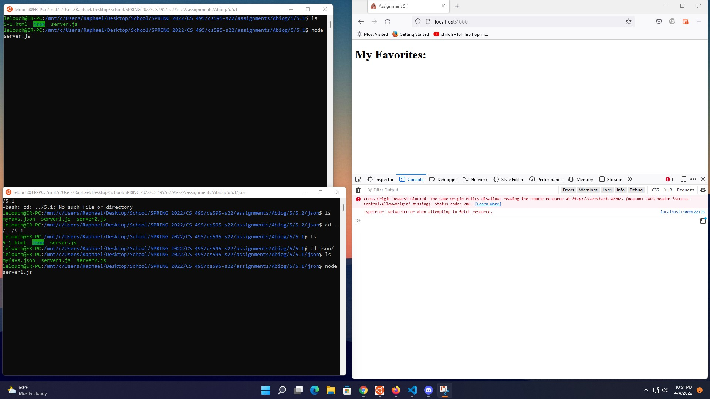
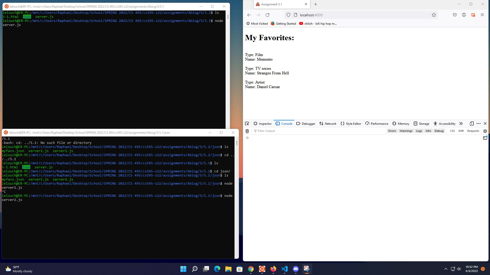
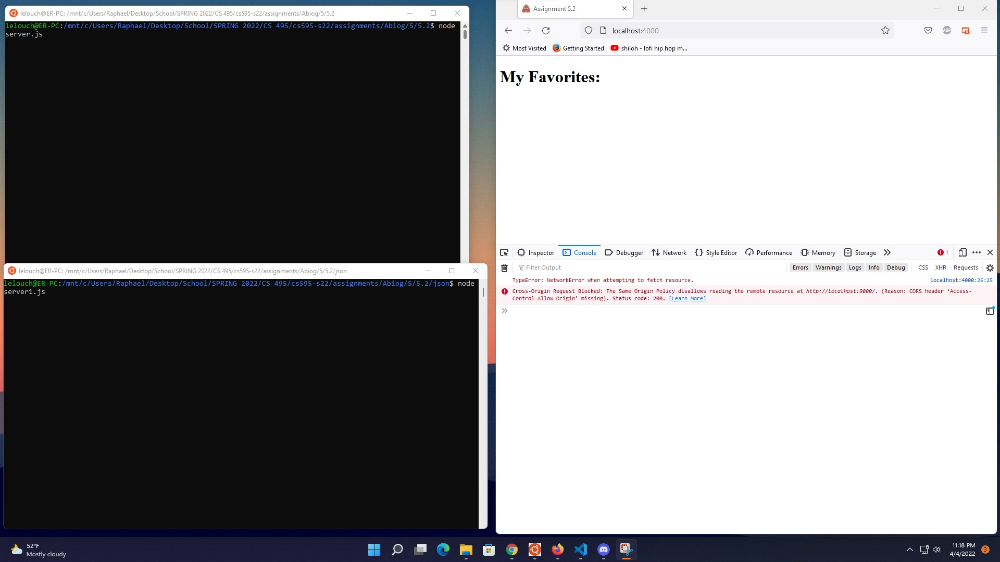
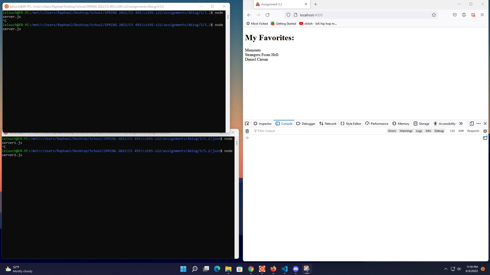
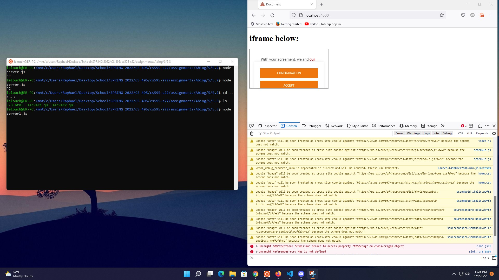
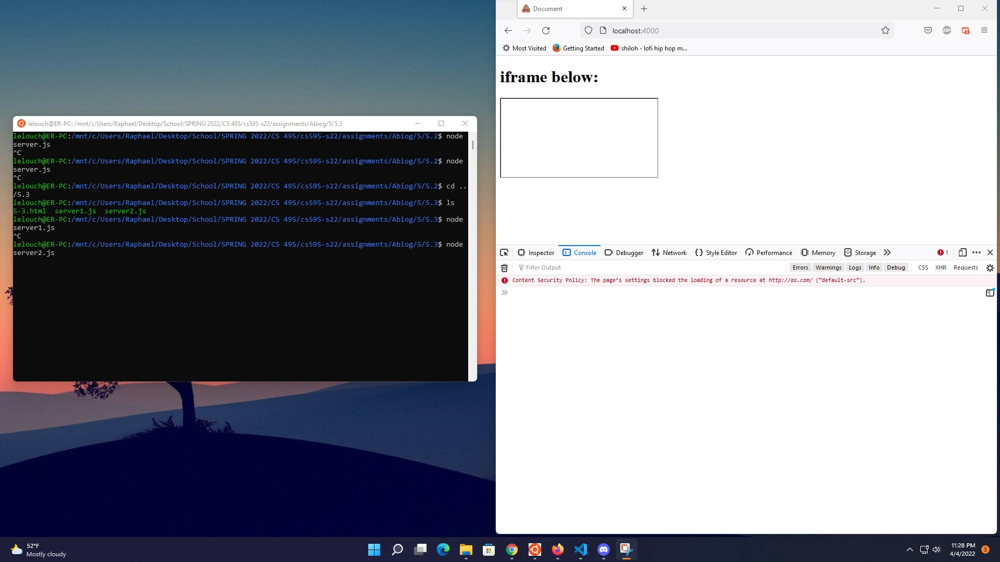

## Assignment 5, CS 495/595 Web Security, Spring 2022

This assignment is divided into three parts and aims to demonstrate CORS and CSP:
* [5.1](5.1/) contains files that demonstrate CORS blocking and reading responses from another origin.
* [5.2](5.2/) contains files that demonstrate CORS blocking and reading HTTP response headers from another origin.
* [5.3](5.3/) contains files that demonstrate how CSP affects embedding from another site.

#   
### 5.1: CORS: Blocking and reading responses from another origin

For this part of the assignment, [5-1.html](5.1/5-1.html) requests a .json response from another origin.
* [server.js](5.1/server.js) is used for this html page running on port 4000.

The file [myfavs.json](5.1/json/myfavs.json) is the json response and contains information about my three favorite things from assignment 2.
* [server1.js](5.1/json/server1.js) is used for this json file running on port 9000 and demonstrates the response being blocked.
* [server2.js](5.1/json/server2.js) is used for this json file running on port 9000 and demonstrates the response being allowed by allowing origin to read data.

**The following screen capture shows the json response being blocked:**

**The following screen capture shows the json response being allowed:**

Video demonstration available here:

#   
### 5.2: CORS: Blocking and reading HTTP response headers from another origin

Similar to 5.1 but this part focuses on blocking and reading HTTP response headers. Three custom HTTP response headers are set based on my three favorite things from assignment 2. [5-2.html](5.2/5-2.html) reads the three HTTP response headers.
* [server.js](5.2/server.js) is used for this html file running on port 4000.
* [server1.js](5.2/json/server1.js) sets the three custom HTTP response headers and demonstrates the response being blocked.
* [server2.js](5.2/json/server2.js) sets the three custom HTTP response headers and demonstrates the response being allowed by allowing origin to read data.

**The following screen capture shows the HTTP resonse headers being blocked:**

**The following screen capture shows the HTTP response headers being allowed:**

Video demonstration available here:

#   
### Content-Security-Policy: embedding from another site

This part of the assignment demonstrates how Content-Security-Policy can prohibit the embedding of sites that allow embedding. [5-3.html](5.3/5-3.html) frames the site [http://as.com](http://as.com) which is framable as seen on the previous assignment.
* [server1.js](5.3/server1.js) is used for this html page and demonstrates that the site is embeddable.
* [server2.js](5.3/server2.js) sets the Content-Security-Policy header that prohibits the embedding.

**The following screen capture shows the site being embedded:**

**The following screen capture shows site not being embedded through CSP:**
