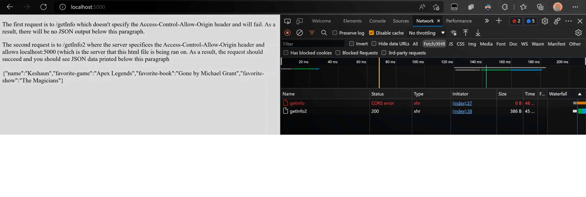
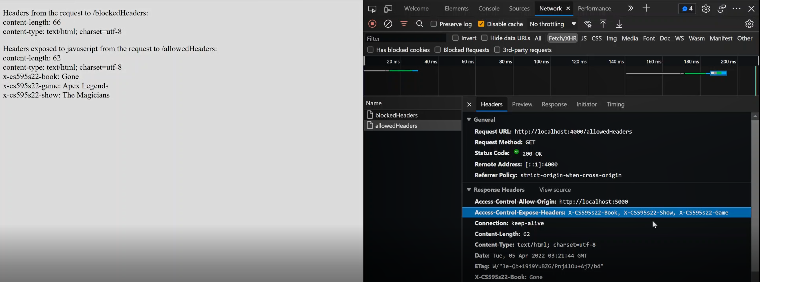
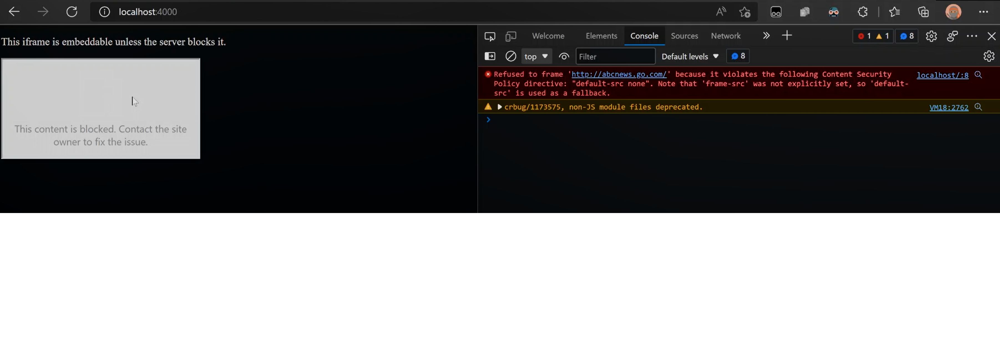

# Keshaun Banks Assignment 5
## 5.1
Link to demonstration: [https://youtu.be/vWAB2xty9yc](https://youtu.be/9GZtwst0OHU)  

For 5.1 I created 4 files:  

    html-server.js
    index.html
    json-server.js
    stuff.json
* ### "html-server.js" simply runs a web server to serve "index.html" on port 5000
* ### "json-server.js" is the http server that returns the json data stored in "stuff.json"
* ### "index.html contains javascript that makes a request to localhost:4000/getInfo and getInfo2 and prints the responses of each. getInfo will fail because the server on port 5000 is a different domain than the one on port 4000 (json-server.js). And because Access-Control-Allow-Origin header is not set on that route it fails.
* ### However, the request to the route /getInfo2 does not fail because the server set the header Access-Control-Allow-Origin to allow localhost:5000 to allow it to access its resources (such as the json data)

  

## 5.2
Link to demonstration: [https://youtu.be/cDdfUllWsTA](https://youtu.be/9GZtwst0OHU)  

For 5.2 I created 3 files:  

    html-server.js
    index.html
    server.js

* ### index.html is similar to 5.1 except that it makes a request to the route /blockedHeaders and a request to /allowedHeaders. Then it lists the headers that are accessible via Javascript in the html
* ### html-server.js serves index.html like before
* ### server.js simply returns custom headers representing my favorite game, tv show, and book. The Javascript in index.html cannot see e custom headers when it calls the route /blockedHeaders. That's because the header "Access-Control-Expose-Headers" was not set on the response for that route.
* ### However, when the javascript attempts to make a request to /allowedHeaders, it can then see the custom headers that were set because "Access-Control-Expose-Headers" was set to expose each of them

  

## 5.3
5.3 only contains 2 files:  
Link to demonstration: [https://youtu.be/9GZtwst0OHU](https://youtu.be/9GZtwst0OHU)  

    index.html
    server.js
* ### index.html contains a single iframe that embeds abcnews.go.com. This site allows embedding.
* ### Server.js serves the index.html but sets 1 header on the response: Content-Security-Policy: 'default-src none'. As a result, when being served the file through the server the iframe embed will be blocked. The CSP disallowed all resources from other domains.

  
