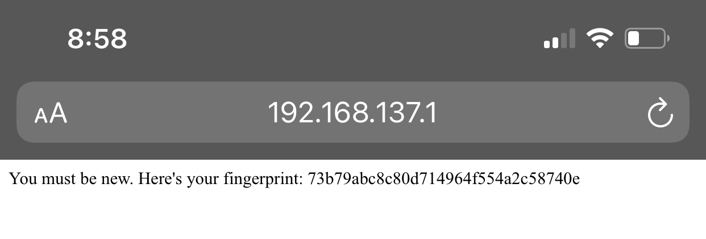
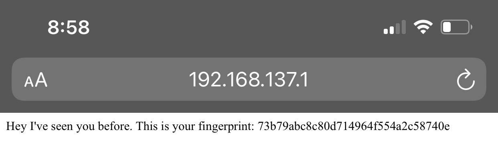
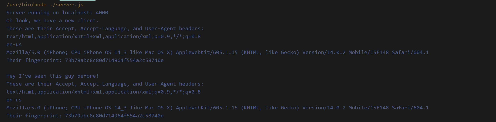
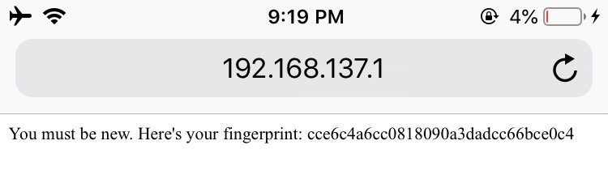
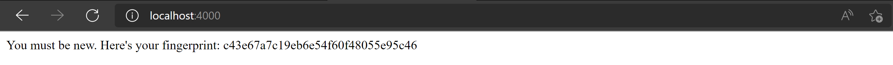
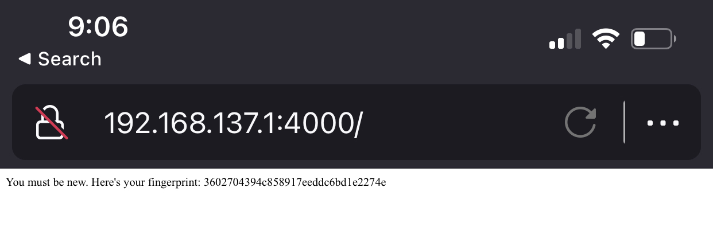

# Keshaun Banks Assignment 6
Link to demonstration: [https://youtu.be/lJCZ4v19I3A](https://youtu.be/lJCZ4v19I3A)

For this assignment I wrote server.js. This file runs an http server that reads 3 headers from each request: Accept, Accept-Language, and User-Agent. The value of each of these header values is concatenated into a single string that gets passed to the md5 function. This generates a hash which I'm using as the fingerprint. If this fingerprint is not in the list of fingerprints (named ``clients`` in server.js) then I add it to the list. If it is in the list then I log that this client has been seen before. 

For the demonstration I used 5 different devices/browsers. For each one I visited the page once so the server could recognize that my fingerprint was not already stored. Then I refreshed the page so the server could recognize that my fingerprint was in the list of previous client.

Here are screenshots of the iPhone11 (using Safari browser) making an initial request and then a 2nd request (by refreshing) and the relevant server log.

# All device screenshots
## iPhone 11 iOS14 Safari

## OnePlus6t Android10 Google Chrome

## iPhone 6 iOS12 Safari

## Windows 11 Microsoft Edge

## iPhone 12 iOS14 Firefox
