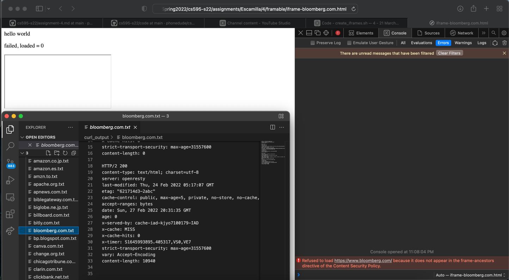
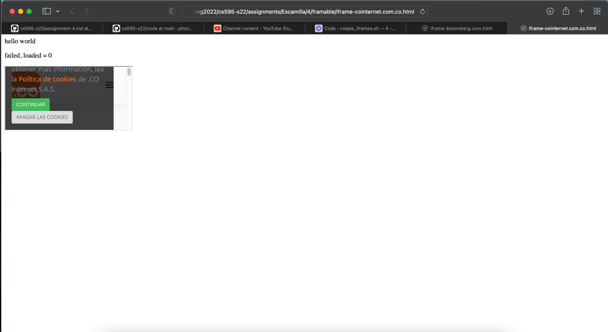

# Assignment 4: iframes
Emily Escamilla
Due: March 21, 2022

## Which public sites are framable?

YouTube: [Assignment 4](https://youtu.be/jEtLT_MigEo)

I used a bash script (create_iframes.sh) to create a HTML file based off of the template provided by Dr. Nelson. An HTML file is created for each of the 100 URLs to insert each URL as an iframe. All of the iframe HTML files are in the `framable` directory. Once the HTMl file is created, I used the command provided by Dr. Nelson to use Google Chrome to run the HTML file. The results are stored in the `framable` directory as well. If the iframe does not load, the HTML will be updated to show "failed". If the iframe does load, the HTML will be updated to show "succeeded". Of the 100 URLs, 83 failed and 17 succeeded. 

There are a few main reasons that the iframe did not work: 

* The `x-frame-options` header is set to `sameorigin` or `deny`
  * This header restricts the URL to be framable only from the same origin or not at all
* The response headers (HW 3) didn't show any of the typical anti-frame headers but Developer mode gave an error in the console (Image 1)
  * The error shown in the console is included in quotes
  * For all of these URLs, the header indicated in the console error is not in the response headers from HW 3
* The JavaScript output said that the iframe did not load, but it really did (Image 2)
  * In investigating each failed URL, I noticed that some URLs did not have an x-frame-options header. When I ran the HTML file in my browser, the HTML updated to say "failed". However, the iframe still loaded in the page

| Site | iframe Defense |
| --- | --- |
| https://www.alexa.com | x-frame-options: SAMEORIGIN |
| https://www.alicdn.com | Failed curl (HW3) |
| https://www.amazon.co.jp | x-frame-options: SAMEORIGIN |
| https://www.amazon.es | x-frame-options: SAMEORIGIN | 
| https://www.amzn.to | HTTP 503 with curl | 
| https://www.billboard.com | x-frame-options: DENY | 
| https://www.bitly.com | HTTP 405 with curl |
| https://www.bloomberg.com | "Refused to load https://www.bloomberg.com/ because it does not appear in the frame-ancestors directive of the Content Security Policy." |
| https://www.bp.blogspot.com | Failed curl (HW3) | 
| https://www.canva.com | x-frame-options: SAMEORIGIN | 
| https://www.change.org | x-frame-options: sameorigin | 
| https://www.cnbc.com | HTTP 503 with curl | 
| https://www.cnet.com | x-frame-options: SAMEORIGIN | 
| https://www.cnil.fr | x-frame-options: SAMEORIGIN | 
| https://www.code.google.com | "Refused to display 'https://www.google.com/' in a frame because it set 'X-Frame-Options' to 'SAMEORIGIN'." |
| https://www.cointernet.com.co | JS output indicates that it did not load but it did load | 
| https://www.cornell.edu | JS output indicates that it did not load but it did load |
| https://www.creativecommons.org | x-frame-options: deny |
| https://www.deezer.com | x-frame-options: SAMEORIGIN |
| https://www.discord.com | x-frame-options: DENY |
| https://www.discord.gg | x-frame-options: DENY |
| https://www.dropbox.com | x-frame-options: DENY |
| https://www.dw.com | JS output indicates that it did not load but it did load | 
| https://www.e-monsite.com | x-frame-options: sameorigin | 
| https://www.en.wikipedia.org | JS output indicates that it did not load but it did load | 
| https://www.eonline.com | x-frame-options: SAMEORIGIN | 
| https://www.es.wikipedia.org | JS output indicates that it did not load but it did load | 
| https://www.europa.eu | x-frame-options: SAMEORIGIN |
| https://www.eventbrite.com | x-frame-options: SAMEORIGIN |
| https://www.express.co.uk | "Refused to load https://www.express.co.uk/ because it does not appear in the frame-ancestors directive of the Content Security Policy."  |
| https://www.fandom.com | x-frame-options: SAMEORIGIN |
| https://www.finance.yahoo.com | x-frame-options: SAMEORIGIN |
| https://www.ftc.gov | x-frame-options: SAMEORIGIN | 
| https://www.github.com | x-frame-options: deny | 
| https://www.google.co.id | X-Frame-Options: SAMEORIGIN |
| https://www.google.co.jp | X-Frame-Options: SAMEORIGIN |
| https://www.hm.com | x-frame-options: DENY |
| https://www.huawei.com | x-frame-options: SAMEORIGIN |
| https://www.issuu.com | x-frame-options: SAMEORIGIN | 
| https://www.linktr.ee | x-frame-options: DENY |
| https://www.maps.google.com | X-Frame-Options: SAMEORIGIN | 
| https://www.mega.nz | Failed curl (HW3) |
| https://www.mit.edu | X-Frame-Options: SAMEORIGIN |
| https://www.naver.com | x-frame-options: DENY | 
| https://www.netvibes.com | x-frame-options: deny |
| https://www.news.yahoo.com | x-frame-options: SAMEORIGIN |
| https://www.nginx.com | "Refused to load https://www.nginx.com/ because it does not appear in the frame-ancestors directive of the Content Security Policy."  | 
| https://www.nicovideo.jp | X-Frame-Options: SAMEORIGIN | 
| https://www.nifty.com | x-frame-options: DENY |
| https://www.nih.gov | X-Frame-Options: SAMEORIGIN |
| https://www.opera.com | x-frame-options: SAMEORIGIN |
| https://www.oup.com | JS output indicates that it did not load but it did load |
| https://www.paypal.com | "Refused to load https://www.paypal.com/us/home because it does not appear in the frame-ancestors directive of the Content Security Policy."  |
| https://www.pexels.com | x-frame-options: SAMEORIGIN |
| https://www.plesk.com | x-frame-options: SAMEORIGIN |
| https://www.plos.org | JS output indicates that it did not load but it did load | 
| https://www.policies.google.com | JS output indicates that it did not load but it did load |
| https://www.privacyshield.gov | x-frame-options: SAMEORIGIN | 
| https://www.psychologytoday.com | x-frame-options: SAMEORIGIN |
| https://www.rambler.ru | x-frame-options: SAMEORIGIN |
| https://www.ru.wikipedia.org | JS output indicates that it did not load but it did load |
| https://www.samsung.com | x-frame-options: SAMEORIGIN | 
| https://www.sendspace.com | x-frame-options: SAMEORIGIN | 
| https://www.steampowered.com | X-Frame-Options: DENY |
| https://www.stores.jp | x-frame-options: SAMEORIGIN |
| https://www.techcrunch.com | x-frame-options: SAMEORIGIN |
| https://www.terra.com.br | x-frame-options: SAMEORIGIN |
| https://www.theverge.com | x-frame-options: SAMEORIGIN |
| https://www.trustpilot.com | x-frame-options: deny |
| https://www.twitter.com | x-frame-options: DENY |
| https://www.upenn.edu | x-frame-options: SAMEORIGIN |
| https://www.weather.com | x-frame-options: SAMEORIGIN |
| https://www.wikihow.com | x-frame-options: SAMEORIGIN |
| https://www.wikimedia.org | JS output indicates that it did not load but it did load |
| https://www.wiley.com | HTTP 405 with curl but "Refused to display 'https://www.wiley.com/en-us' in a frame because it set 'X-Frame-Options' to 'SAMEORIGIN'." | 
| https://www.www.over-blog.com | x-frame-options: DENY | 
| https://www.www.weebly.com | X-Frame-Options: SAMEORIGIN |
| https://www.xbox.com | "Refused to display 'https://www.xbox.com/en-US/' in a frame because it set 'X-Frame-Options' to 'DENY'." |
| https://www.yandex.ru | x-frame-options: DENY |
| https://www.youtu.be | x-frame-options: SAMEORIGIN |
| https://www.youtube.com | x-frame-options: SAMEORIGIN |

Image 1: After following the redirects, the HTTP headers are shown in the bottom left corner. The error message is shown in the bottom right corner. It cites the Content Security Policy as preventing the iframe from loading. However, there is no Content Security Policy header in the HTTP headers from HW 3.

Image 1: When calling the `checkload()` function, the page displayed a window length of 0 meaning that the iframe failed. However, the iframe is still displayed as shown. 