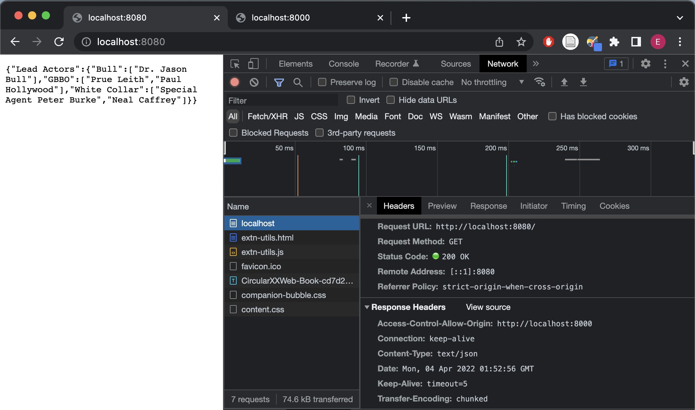
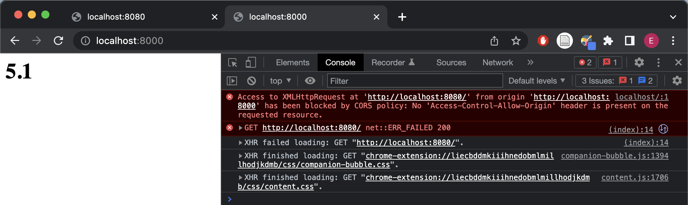
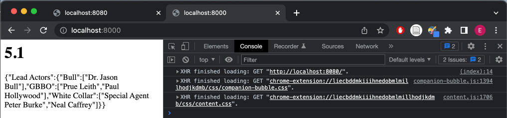
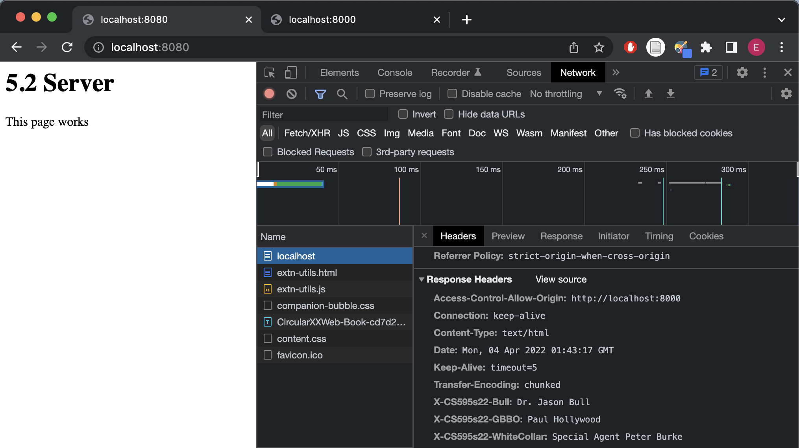
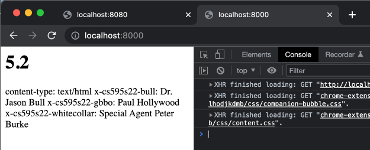
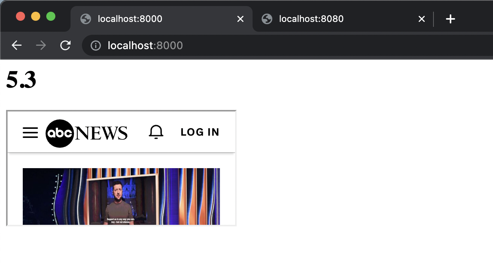
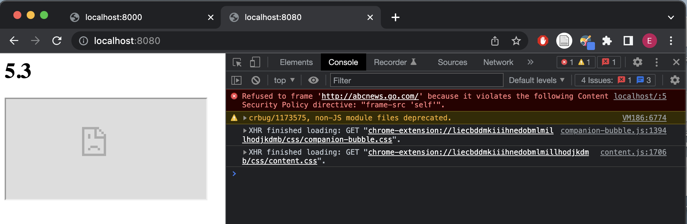

# Assignment 5, CS 495/595 Web Security, Spring 2022
Due: 2022-04-04

Emily Escamilla

## 5.1: CORS - Blocking and reading responses from another origin

I created a basic client on port 8000 with [client.js](5.1/client.js) which renders [client.html](5.1/client.html). I also created a basic server on port 8080 that responds with JSON data as shown below: 

By default, CORS prohibits sharing content like JSON across origins. This default functionality is shown when running [server_block.js](5.1/server_block.js) as shown below. 

I added the `Access-Control-Allow-Origin` header in
[server_allow.js](5.1/server_allow.js) to allow the JSON data to be read by the client. The result is shown below:

[YouTube link](https://youtu.be/qv_5vOMSbJ0)

### Resources: 

* CORS, [https://developer.mozilla.org/en-US/docs/Web/HTTP/CORS](https://developer.mozilla.org/en-US/docs/Web/HTTP/CORS)
* Using XMLHttpRequest, [https://developer.mozilla.org/en-US/docs/Web/API/XMLHttpRequest/Using_XMLHttpRequest](https://developer.mozilla.org/en-US/docs/Web/API/XMLHttpRequest/Using_XMLHttpRequest)
* Getting the XMLHttpRequest response, [https://stackoverflow.com/questions/3038901/how-to-get-the-response-of-xmlhttprequest](https://stackoverflow.com/questions/3038901/how-to-get-the-response-of-xmlhttprequest)

## 5.2: CORS - Blocking and reading HTTP response headers from another origin

Most of the code for 5.2 is very similar to the code for 5.1. I created another simple client on port 8080 with [client.js](5.2/client.js) which renders [client.html](5.2/client.html). I created a simple server on port 8000 in [server_noheaders.js](5.2/server_noheaders.js). By default, the headers are not exposed by the server. The server and it's headers are shown below:

Accessing the server's headers in the client does not show the X-CS595S22-* headers as shown in the following image.

In order to expose the headers, I added the `Access-Control-Expose-Headers` header to the server in [server_headers.js](5.2/server_headers.js). The header is show below: 

Now, the client can access the server's headers as shown in the following image:

[YouTube link](https://youtu.be/arrwRnJi8Zk)

### Resources

[Getting the XMLHttpReequest response headers](https://developer.mozilla.org/en-US/docs/Web/API/XMLHttpRequest/getResponseHeader)
[Expose headers](https://stackoverflow.com/questions/8945587/xmlhttprequest-getallresponseheaders-not-returning-all-the-headers)

## 5.3: Content-Security-Policy - embedding from another site

This part of the assignment was different than 5.1 and 5.2. The rendered page was the same for both allowing and blocking the iframe. In [client.html](5.3/client.html), I inserted an iframe for `http://abcnews.go.com`. By default, the iframe is allowed by the client in [client_allowframe.js](5.3/client_allowframe.js) as shown in the following image.

In order to block the iframe, I added the `Content-Security-Policy` header to the client in [client_blockframe.js](5.3/client_blockframe.js). This results in the iframe being blocked by the client as shown below:

[YouTube link](https://youtu.be/8F_JuM5OAdM)

### Resources

[NodeJS Content Security Policy](https://stackoverflow.com/questions/21048252/nodejs-where-exactly-can-i-put-the-content-security-policy)

