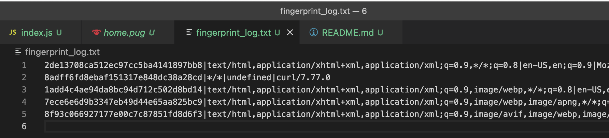

# Assignment 6, CS 495/595 Web Security, Spring 2022
Due: 2022-04-18

Emily Escamilla

The algorithm for fingerprinting was fairly simple. I took the 'user-agent', 'accept', and 'accept-language' request headers and passed them to the md5 hashing library. Then, if the hash was not already in the log, I wrote the request headers and hash to the log file. When the user navigates to the `localhost:4000/`, they are welcomed with an identifying number that essentially communicates "You've been here before". 

I tested the fingerprinting with the following 6 browsers: 

* Safari
* curl
* Firefox
* Microsoft Edge
* Google Chrome
* Brave

The order above is the order that the browsers appear in the screenshot of the log below.

YouTube: [https://youtu.be/DSzTqftlo3A](https://youtu.be/DSzTqftlo3A)