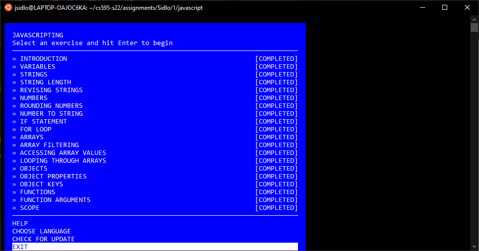
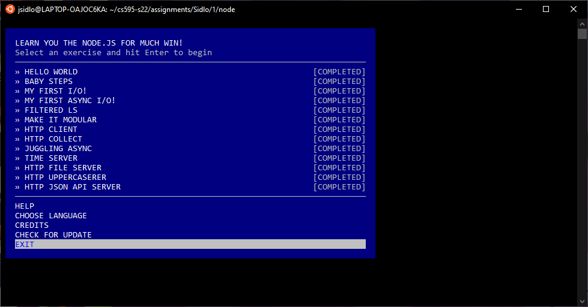

## cs595-s22 Assignment 1

In this assignment, we worked through three modules: learnyouhtml, javascripting, and learnyounode. The files associated with each are found in the three directories: html, javascript, and node.

* The three directories:
  * [html](html)
  * [javascript](javascript)
  * [node](node)

* Screenshots of completion:

* YouTube link showing completion: [https://youtu.be/UVql3IyDU-c](https://youtu.be/UVql3IyDU-c)
