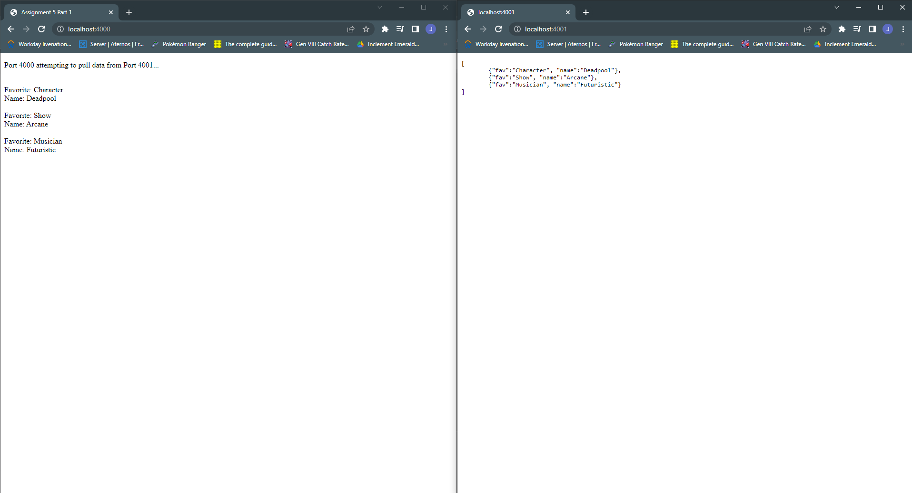
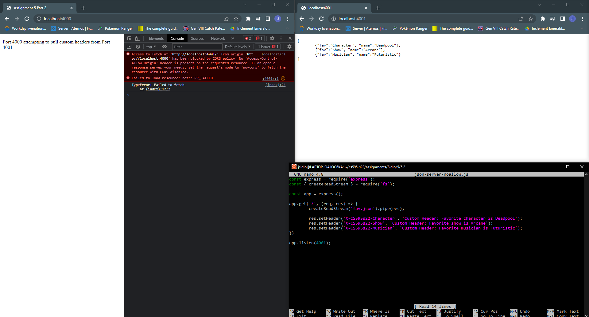
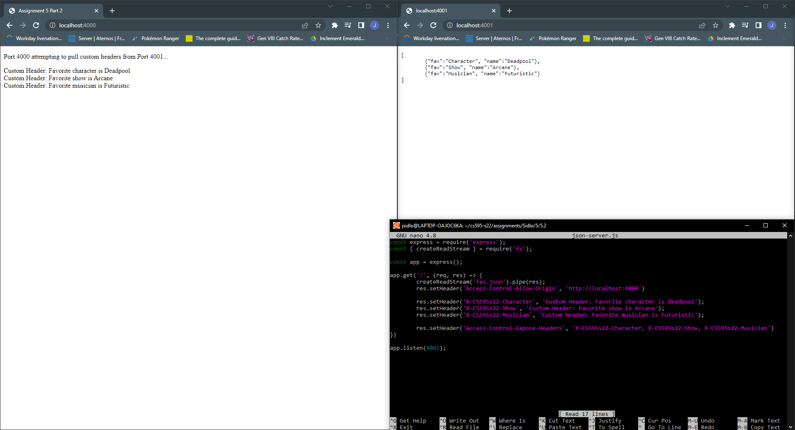
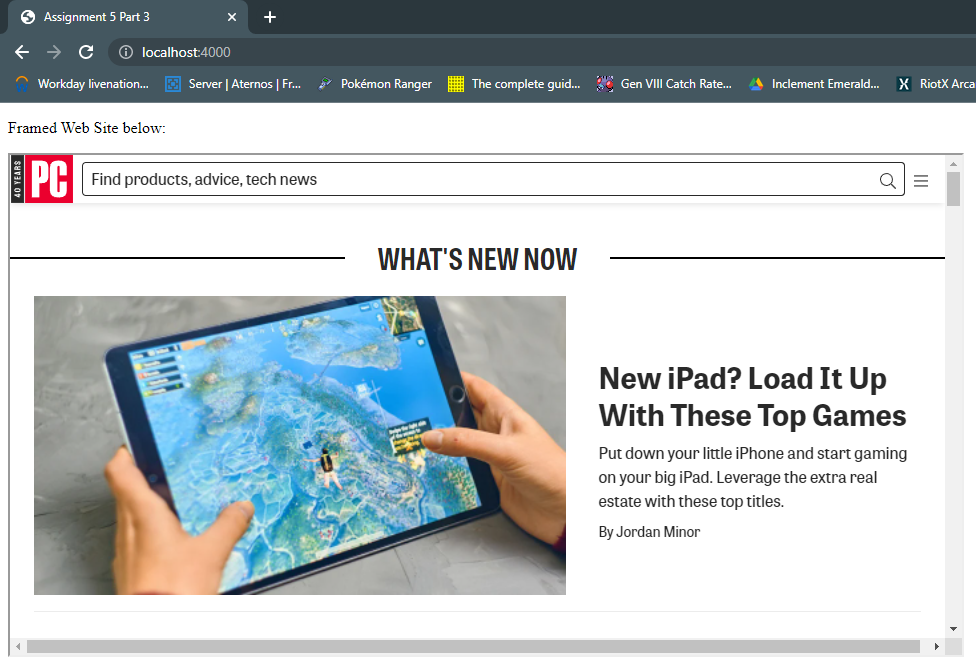
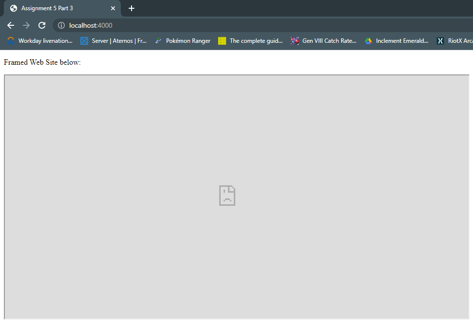

## cs595-s22 Assignment 5

### Part 1

For Part 1, I created a json file named fav.json that contained the favorites that I had selected from assignment 2. I also created an html page (5-1.html) that would then attempt to access the json data hosted on another origin. Below are images showing it both working and not working, as well as a video showing the files and processes.

Allowed

Blocked

Related YouTube video: [https://youtu.be/WZf0B028ndo](https://youtu.be/WZf0B028ndo)

### Part 2

For Part 2, I continued using the fav.json file from before, and adapted the remaining files to now set custom headers and then display them when allowed and not when they are blocked. Below are the related screenshots for this portion of the assignment as well as the video for the part.

Allowed

Blocked

Related YouTube video: [https://youtu.be/Jv9-61BuTpc](https://youtu.be/Jv9-61BuTpc)

### Part 3

For Part 3, I found a site that allowed framing from our previous assignment, which I chose http://pcmag.com . This site was already able to be framed and as such, I initially provide proof of this. I then use my locally set up server to block the framing attempt, causing the site to no longer show up on my page. Below are screenshots showing these steps as well as a video showing the process.

Allowed

Blocked

Related YouTube video: [https://youtu.be/OxKptznl8Qo](https://youtu.be/OxKptznl8Qo)
