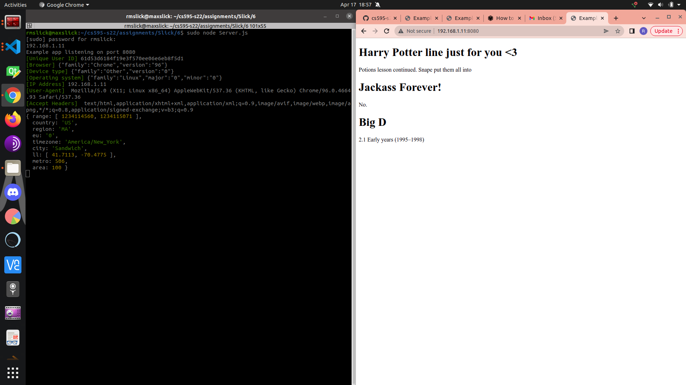
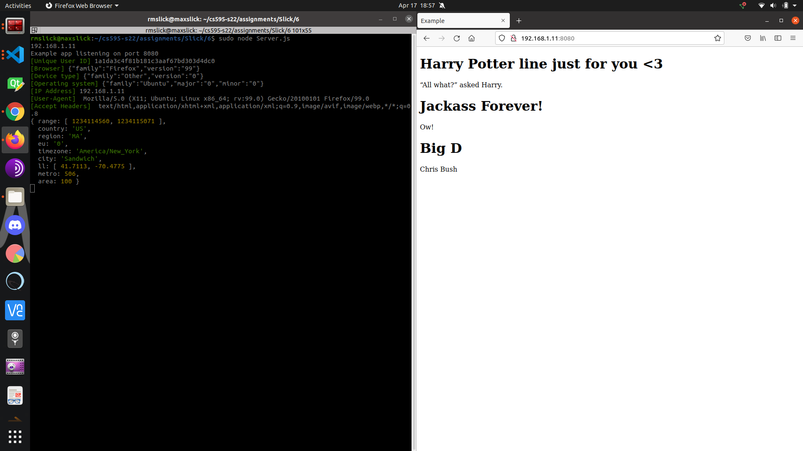
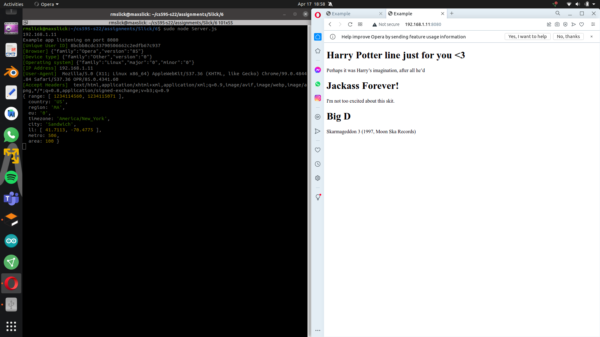
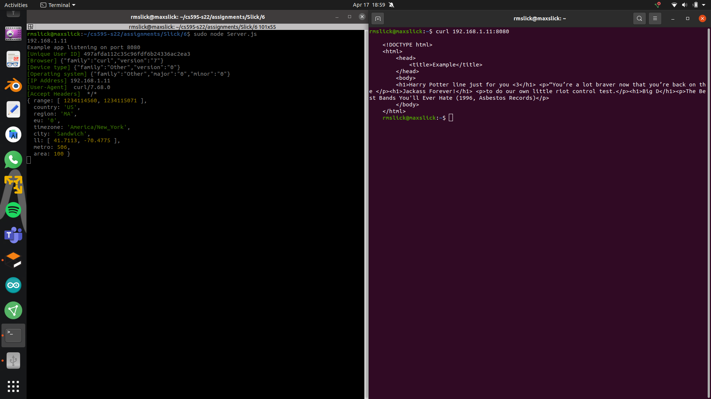
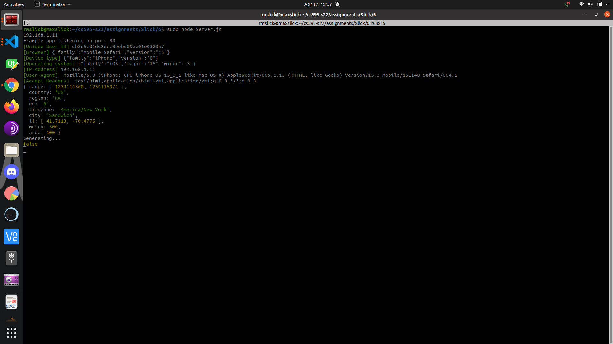
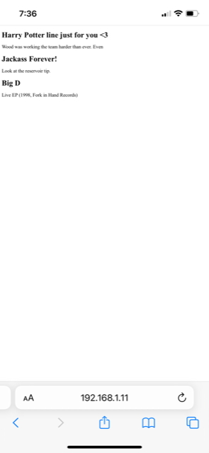

## Assignment 6, CS 495/595 Web Security, Spring 2022

Due: 2022-04-18

Points available: 15

For this assignment, you will fingerprint various browsers on your local network.  

Relevant resources:

* [md5](https://www.npmjs.com/package/md5)
* [req.get](http://expressjs.com/en/api.html#req.get)
* [echo service](http://scooterlabs.com/echo) -- currently ```HTTP 500```?
* [httpbing.org](https://httpbin.org/headers)

### Fingerprint at least 5 different clients 

Write server side code for your Express server that fingerprints browsers (as per week 7's lecture).  The server should write these fingerprints out to a server-side log and recognize the client when it visits again.  For different clients, use different browsers (Firefox, Chrome, Opera, curl, Safari, etc.) as well as different devices on your local network (phones, tablets, etc.).  

Use at least three different HTTP request headers to form your browser fingerprint.

#### Input
Fingerprinting data collection:
- Browser
- Device type
- Operating System
- IP Address
- User-Agent
- Geolocation
### Technique
Parses the user agent string included in the headers to obtain browser, device, OS information and the ip address. Uses external package express-fingerprint to obtain geolocation information and produce hashstring unique to client. Client hash identifiers are stored in [users.json](./users.json) 
#### Output
A unique hash ID that maps to client used for recognition (See examples in [users.json](./users.json))

#### Client 1 - Chrome browser



#### Client 2 - Firefox browser



#### Client 3 - Opera browser



#### Client 5 - Curl browser



#### Client 5 - Mobile iOS Safari browser




### Extra credit (5 points)

For each fingerprint, serve a different HTML file based on some combination of your three favorite things from Assignment 2.  This way each client has a unique experience, different from other clients.  See also: [cloaking](https://en.wikipedia.org/wiki/Cloaking).
### DEMO VIDEO
##### The below video demonstrates the Extra credit and, by consequence, the mechanisms for recognition of the clients.
[Demo and Extra credit demonstration](https://youtu.be/CLrBnKbuTbs)

### Setting up directory "6"

All of the code, files, images, etc. necessary to complete this assignment will be in directory ```6```.  The README.md for this assignment will have links to the code, a short description of the fingerprinting algorithm, a screenshot of the 5+ fingerprints, as well as a link to the Youtube video demonstrating the clients connecting and being recognized by the server.
