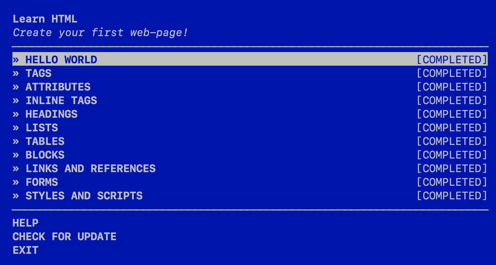
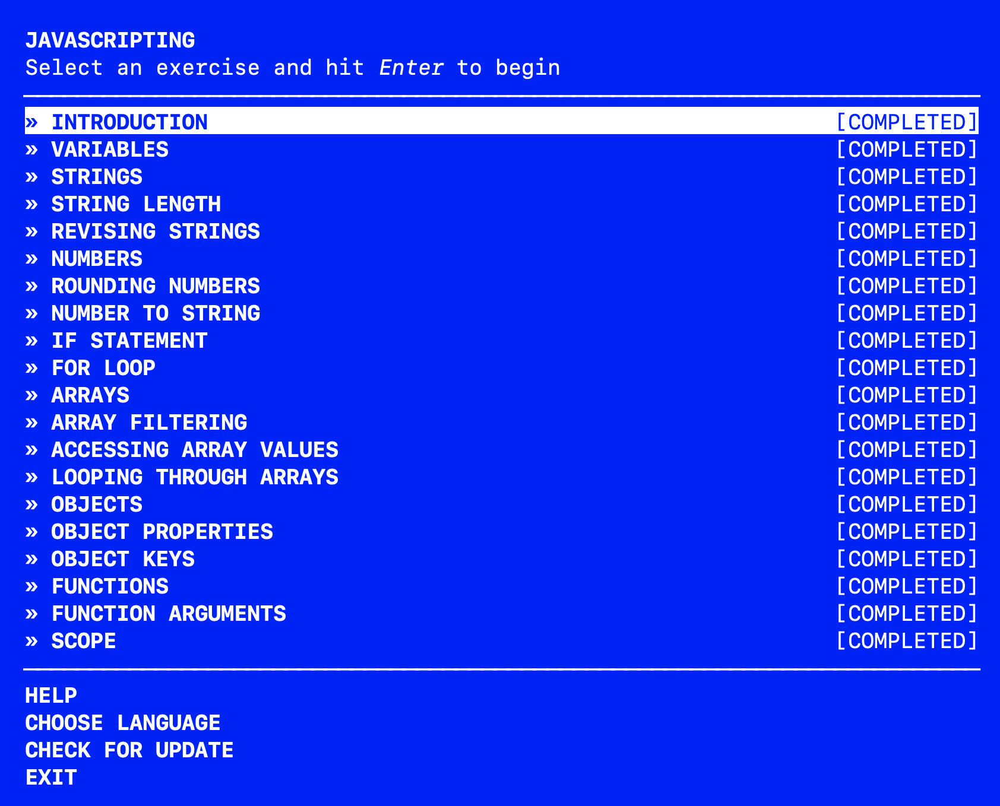
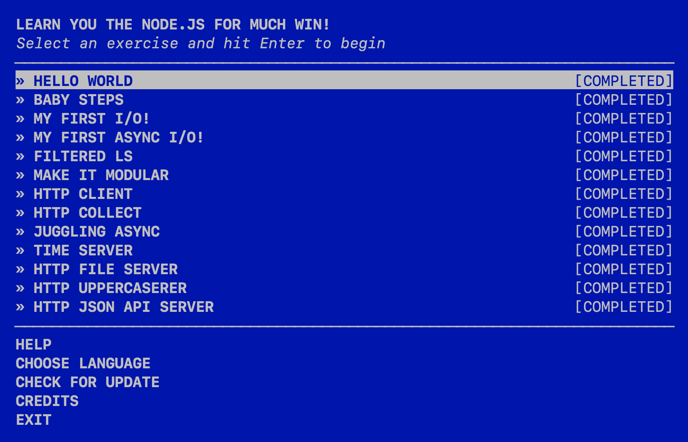

# Assignment 1, CS 495/595 Web Security, Spring 2022
## Due: 2022-01-24

## Description

* This assignment provided the basic understanding and skills in HTML, JavaScript and Node.

* There are 4 folders namely [Images](Images), [html](html), [javascript](javascript) and [node](node).

* The folder 'Images' contains screenshots of the completed commands.

* Rest of the folders contain scripts used to complete the commands in 'learnyouhtml', 'javascripting' and 'learnyounode'.

## Screenshots

* Provided below is the screenshot of the completion of learnyouhtml,

* Provided below is the screenshot of the completion of javascripting,

* Provided below is the screenshot of the completion of learnyounode,

## Youtube video

* The youtube video link: 
