# Assignment 5

Sivakanesan Dhanushkanda

CS 495/595 Web Security

Spring 2022


## 5.1: CORS: Blocking and reading responses from another origin

### Youtube Video: 

* https://youtu.be/zhCkVclQ4Fg


## List of directories

* [Main HTML](5.1/files/main.html)
* [JSON response](5.1/files/fav.json)
* [Server hosting HTML](5.1/server.js)
* [Server hosting JSON which prevents access](5.1/block.js)
* [Server hosting JSON which allows access](5.1/allow.js)

### Steps

* [JSON response](5.1/files/fav.json) code contains the information about the three favourite things from assignment 2

```
{
  "Movie": {
    "name": "98",
    "reason": "96 is a tamil movie released in 2018. The story revolved around 2 long-lost lovers reunited by their high-shool 20 year anniversary. They share a low-key night together and talk about how things could have been.",
    "URL": "https://en.wikipedia.org/wiki/%2796_(film)"
  },
  "Music_Artist": {
    "name": "A.R.Rahman",
    "reason": "A.R.Rahman is a world-renowned music artist. His unorthodox style of music and soul melting melodies are a die for. ",
    "URL": "https://en.wikipedia.org/wiki/A._R._Rahman"
  },
  "TV_Show": {
    "name": "Witcher",
    "reason": "Witcher is probably my favourite TV series. The fact that nothing can be predicted is what keeps me glued to the screen.",
    "URL": "https://en.wikipedia.org/wiki/The_Witcher_(TV_series)"
  }
}
```

* [Main HTML](5.1/files/main.html) has the JSON response which is used by the JavaScript running in another HTML ro request for it.

```
<html>
<title>
Welcome to Assignment 5.1
</title>
<h1>Skanda Siva, CS 495/595 - Spring 2022, ODU</h1>
<br><br>
Demonstrating how Javascript running in one HTML file requests a .json response from another origin.

<script>
  fetch('http://localhost:8002/fav.json')
  .then(response => response.json())
  .then(data => console.log(data));
</script>
</html>
```

* [block.js](5.1/block.js) prevents access because the CORS headers are not defined. 

  * Code,
  
  ```
  const {createReadStream} = require('fs')
  const express = require('express')
  const app = express()
  const port = 8002
  
  app.get('/', (req, res) => {
    createReadStream('files/fav.json').pipe(res)
  })
  
  app.listen(port, () => {
    console.log(`Block server listens at http://localhost:${port}`)
  })
  
  app.use(express.static('files'))
  ```
  
  * When inspecting the elements, the console will show the following messages
  
  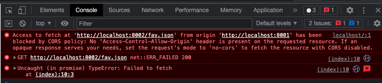
  
  * Checking in the Network tab, we can see the "fav.json" failed to load the response data
  
  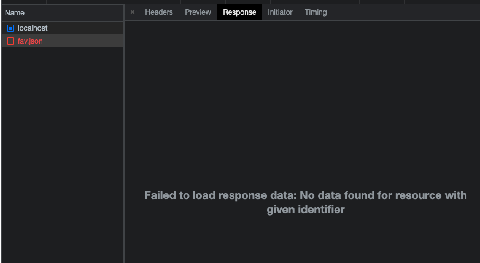
  
  * We can also see that there are no 'Access-Control-Allow-Origin' headers set 
  
  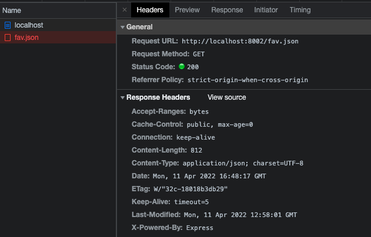


* [allow.js](5.1/allow.js) allows access after setting the CORS headers here. This will allow the JSON response to be shared with the [server hosting HTML](5.1/server.js)

  * The updated code block is shown below,
  
  ```
  var cors = require('cors')
  app.use(cors())
  ```
  
  * 'Access-Control-Allow-Origin' header is set to '*' so it shows all that is set below.
  
  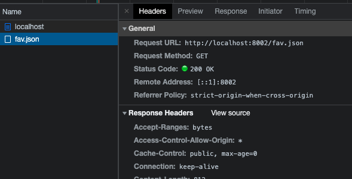
  
  * Console shows the JSON as well.
  
  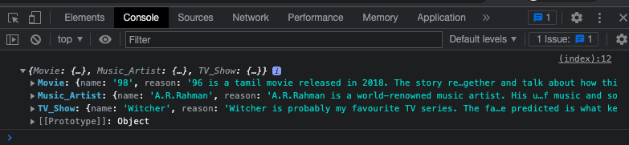
  
  * Networks tab shows the whole JSON file
  
  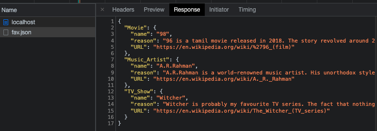


## 5.2: CORS: Blocking and reading HTTP response headers from another origin

### Youtube Video: 

* https://youtu.be/N61O94kiYEE


## List of directories

* [Main HTML](5.2/files/main.html)
* [JSON response](5.2/files/fav.json)
* [Server hosting HTML](5.2/server.js)
* [Server which prevents access](5.2/block.js)
* [Server which allows access](5.2/allow.js)

### Steps

* [Main HTML](5.2/files/main.html) has the three custom HTTP response headers which is used by the JavaScript running in another HTML ro request for it.

  * Updated code block
  
  ```
  <html>
  <title>
  Welcome to Assignment 5.2
  </title>
  <h1>Skanda Siva, CS 495/595 - Spring 2022, ODU</h1>
  <br><br>
  Demonstrating how custom HTTP response headers are both blocked and then allowed by one server.
  
  <script>
    fetch('http://localhost:8002/')
    .then(response => {
      var movie = response.headers.get("X-CS595s22-movie")
      var musicartist = response.headers.get("X-CS595s22-musicartist")
      var tvseries = response.headers.get("X-CS595s22-tvseries")
      console.log(movie)
      console.log(musicartist)
      console.log(tvseries)
    })
  </script>
  </html>
  ```


* [block.js](5.2/block.js) prevents access because the CORS headers are not defined. 

  * Code,

  ```
  const {createReadStream} = require('fs')
  const express = require('express')
  const app = express()
  const port = 8002
  
  app.get('/', (req, res) => {
    res.set('X-CS595s22-movie', '96')
    res.set('X-CS595s22-musicartist', 'A.R.Rahman')
    res.set('X-CS595s22-tvseries', 'Witcher') 
    res.send("<html><title>Skanda's Page 5.2</title><h1>Welcome to my page!<br></h1>Skanda Siva, CS 495/595 - Spring 2022, ODU</html>")
  })
  
  app.listen(port, () => {
    console.log(`Block server listens at http://localhost:${port}`)
  })
  
  app.use(express.static('files'))
  ```

  * When inspecting the elements, the console will show the following messages
  
  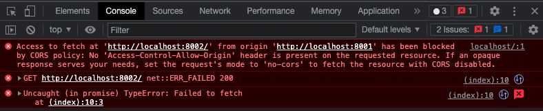
  
  * Checking in the Network tab, we can see the localhost failed to load the response data
  
  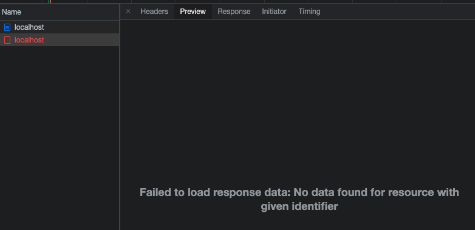
  
  * We can also see that there are no 'Access-Control-Allow-Origin' headers set 
  
  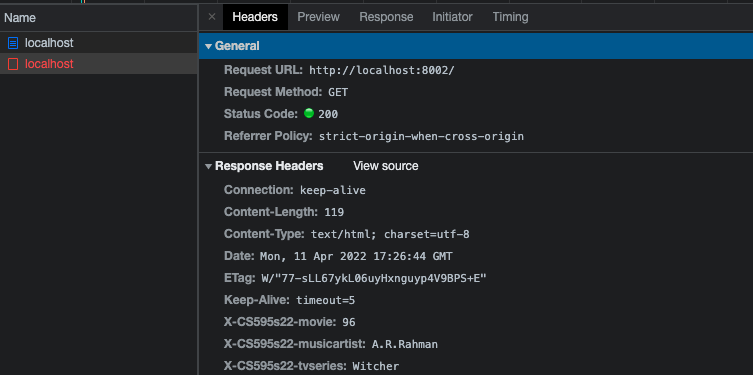


* [allow.js](5.2/allow.js) allows access after setting the CORS headers here. This will allow the JSON response to be shared with the [server hosting HTML](5.2/server.js)

  * The updated code block is shown below,
  
  ```
  var cors = require('cors')
  app.use(cors())
  ```
  
  * 'Access-Control-Allow-Origin' header is set to '*' so it shows all that is set below.
  
  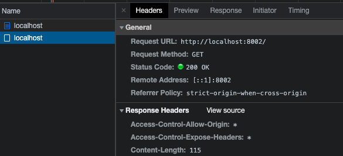
  
  * Console output is shown below,
  
  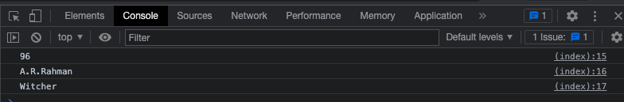
  
  * Networks tab shows the HTML code we provided in the main.html code
  
  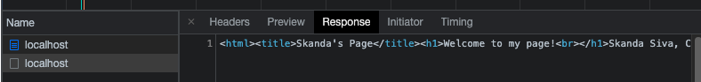

  

## 5.3: Content-Security-Policy: embedding from another site

### Youtube Video: 

* https://youtu.be/CMf1W_PS_dM


## List of directories

* [Main HTML](5.3/files/main.html)
* [Server which prevents access](5.3/block.js)
* [Server which allows access](5.3/allow.js)

### Steps


* The site I chose from assignment 4: www.usnews.com

* [Main HTML](5.3/files/main.html) has the embedded site using JavaScript

  * Code
  
  ```
  <html>
  <title>
  Welcome to Assignment 5.3
  </title>
  <h1>Skanda Siva, CS 495/595 - Spring 2022, ODU</h1>
  <br><br>
  Demonstrating a local HTML file being allowed to embed the remote site as well as a local server prohibiting the embedding.
  
  <script>
    const iframe = document.createElement('iframe')
    iframe.src = 'https://www.usnews.com/'
    document.body.appendChild(iframe)
  </script>
  </html>
  ```

* [block.js](5.3/block.js) restricts the embedding of the site from another origin.

  * Code,
  
  ```
  const {createReadStream} = require('fs')
  const express = require('express')
  const app = express()
  const port = 8002
  
  app.use(function (req, res, next) {
    res.setHeader(
      'Content-Security-Policy',
      "default-src 'self'; script-src 'self'"
    );
    next();
  });
  
  app.get('/', (req, res) => {
    createReadStream('files/main.html').pipe(res)
  })
  
  app.listen(port, () => {
    console.log(`Block server listens at http://localhost:${port}`)
  })
  
  app.use(express.static('files'))
  ```

  * When inspecting the elements, the console showed the following messages
  
  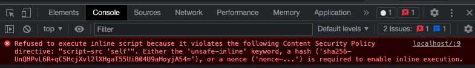

  * We can also see that the 'Content-Security-Policy' headers set. This prevents the server to restrict a framable site to be embedded in the HTML file it hosts.
  
  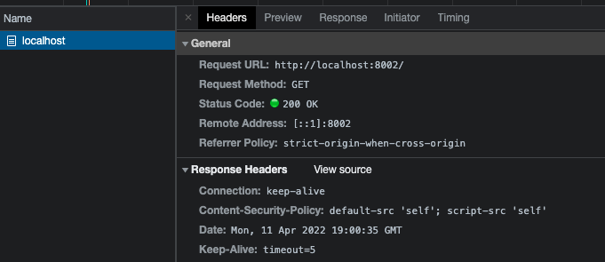
  
  
* [allow.js](5.3/allow.js) allows access after setting the 'Content-Security-Policy' headers here. In order to enable inline execution, the 'unsafe-inline' is also used.
  
  * Code
  
  ```
  const {createReadStream} = require('fs')
  const express = require('express')
  const app = express()
  const port = 8002
  
  app.use(function (req, res, next) {
    res.setHeader(
      'Content-Security-Policy',
      "default-src 'self' https://www.usnews.com/; script-src 'self' 'unsafe-inline'"
    );
    next();
  });
  
  app.get('/', (req, res) => {
    createReadStream('files/main.html').pipe(res)
  })
  
  app.listen(port, () => {
    console.log(`Allow server listens at http://localhost:${port}`)
  })
  
  app.use(express.static('files'))
  ```

  * A screenshot of the HTML page along with the elements
  
  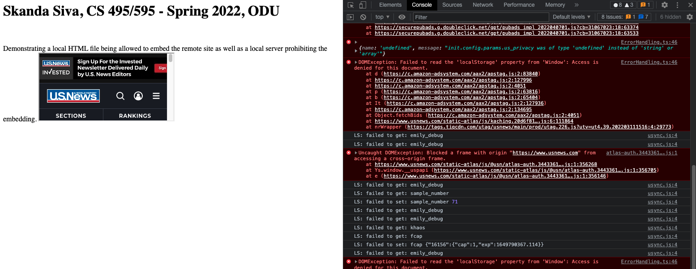
  
  * 'Content-Security-Policy' header is set.
  
  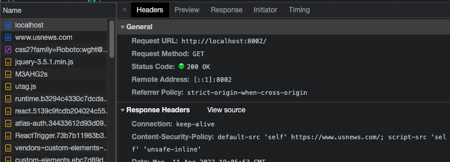

  * Networks tab shows the HTML code we provided in the main.html code and the embedded site
  
  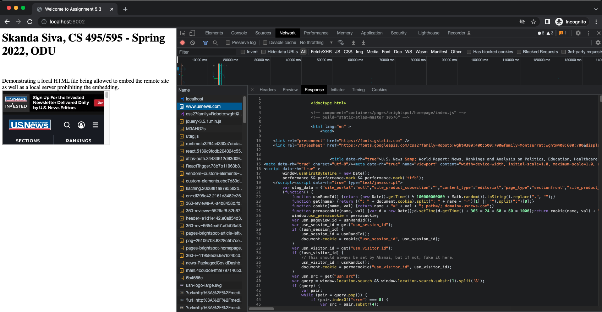


## References

1. https://expressjs.com/en/resources/middleware/cors.html
2. https://www.digitalocean.com/community/tutorials/how-to-secure-node-js-applications-with-a-content-security-policy
