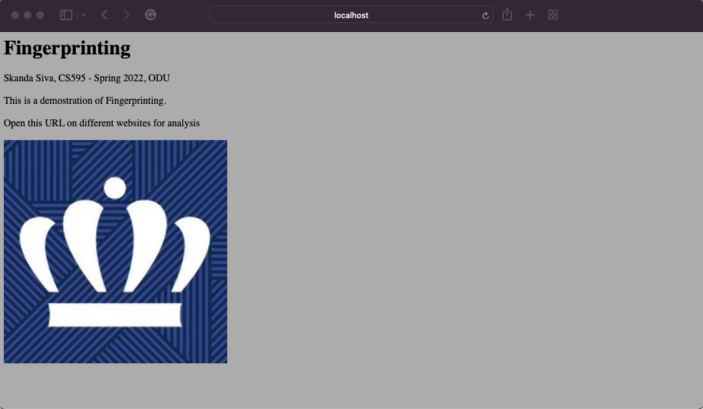
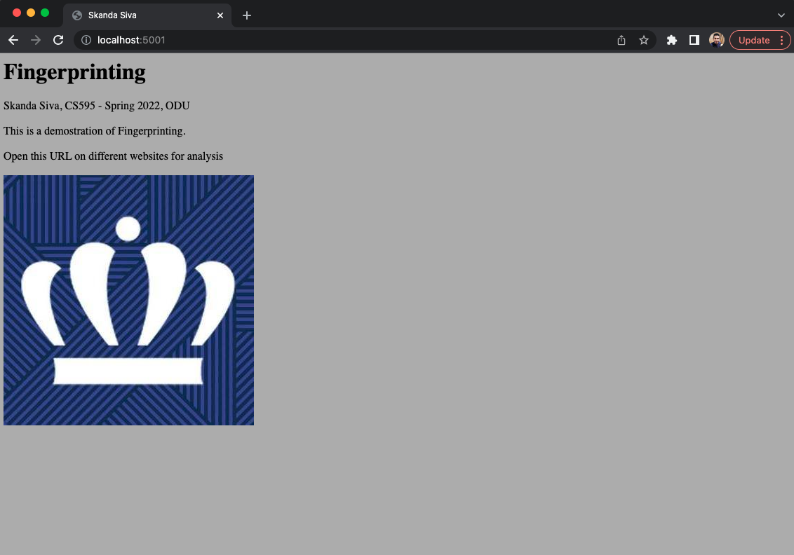
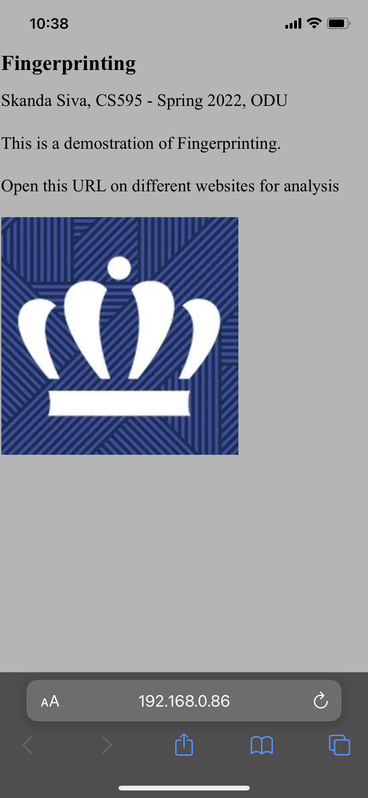
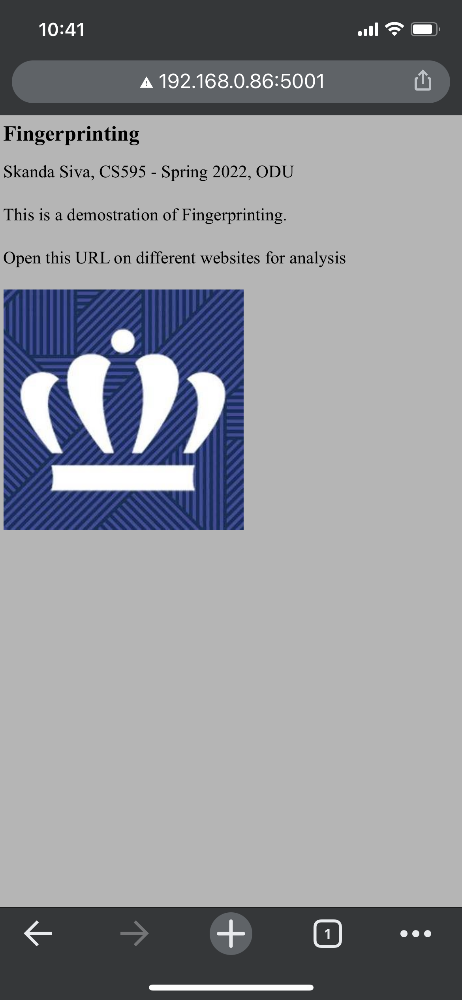
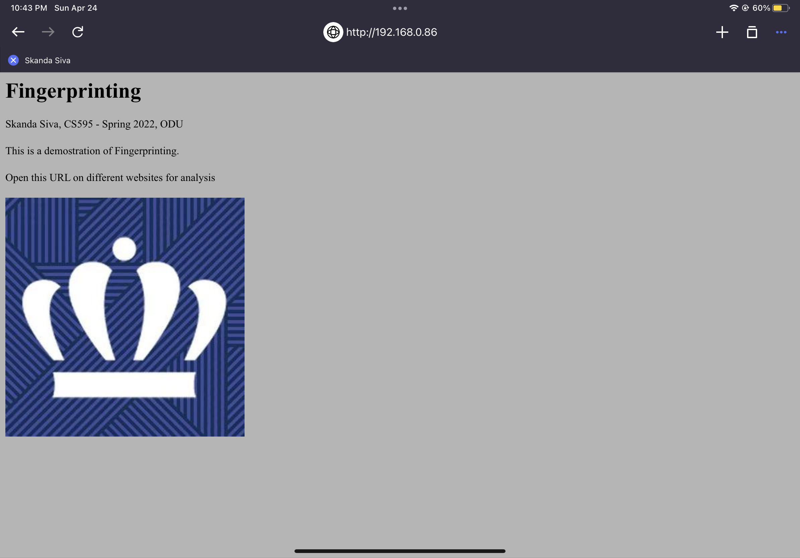
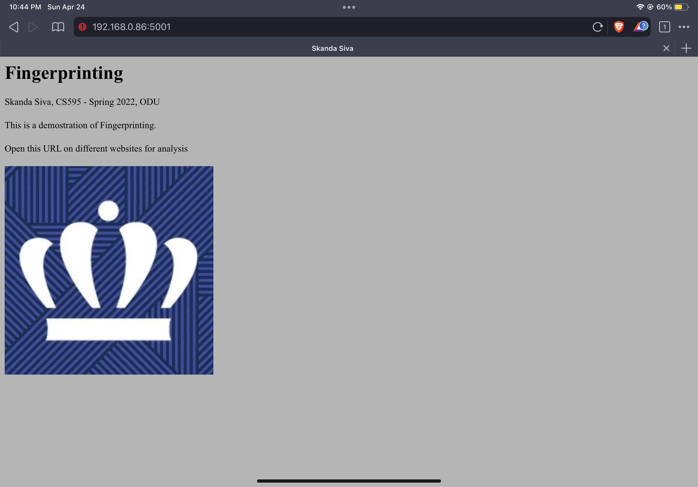

# Assignment 6, Fingerprinting

#### Sivakanesan Dhanushkanda, CS 495/595 Web Security, Spring 2022


### List of Directories

* [Server side code](server.js)
* [Main HTML file](html/main.html)
* [ODU image](html/images/odu.jpeg)
* [Visitor log information](sslogs.log)
* [Screenshots](Images)


### Youtube Video: https://youtu.be/diOw_gsO5lY


### Process

* Step 1- Create the server side code
  * Used 3 different HTTP request headers ('User-Agent', 'Accept', 'Accept-Language')
  * Created a single string by concatenating all three of them
  * First, have to check the logs if a user entry exists
  * If no user with the unique ID, then I obtained the visitor information and logged the information on [sslogs.log](sslogs.log)
  * If the unique ID is in the log file, then the count number is incremented
  * For ease, I displayed the visitor information on the console itself
  * Code is provided below,


```
const {createReadStream} = require('fs')
const express = require('express')
const fs = require('fs')
const md5 = require('md5')
const app = express()
const http = require("http")
const port = 5001

app.get('/', (req, res) =>
	{
		// using 3 different HTTP request headers to form the browser fingerprint
		header1 = req.get('User-Agent')
		header2 = req.get('Accept')
		header3 = req.get('Accept-Language')

		// concatenating the features to creat a string, and then hashing the fingerprint using md5
		var fingerprint = header1.concat(header2, header3)
		var fp_id = md5(fingerprint)

		// serving the file
		stream = createReadStream('html/main.html')
		stream.pipe(res)

		// readint the server-side log file to check if the visitor is new or already existing
		fs.readFile('sslogs.log', function(err, data) 
		{
			if(err) throw err;	
				var array = data.toString().split("\n")
			array.pop()					// popping the 1st row from the file
				var found = array.find(a =>a.includes(fp_id));
				if (found) 
				{
					// if the visitor details are already there, or if he already visited the website
					for(i = array.length-1; i >= 0; i--) 
					{
					const objct = JSON.parse(array[i])
					if(objct['id'] == fp_id)
					{
						visitor = objct
						visitor['previous-visit'] = new Date()
						visitor['count-visit'] = visitor['count-visit'] + 1
						log_line = (JSON.stringify(visitor)).concat('\n')
						fs.appendFile('sslogs.log', log_line, err => 
						{
						if (err) 
							{
							console.error(err)
							return
							}
						}
												)
						console.log(`ID: ${fp_id} Returning user. Last Visit:${visitor['count-visit']}`)
						return

					}
				}
			}
				else							// if it is a new , creating an entry in the sslogs and appending it.
				{
					visitor = {}
					visitor['id'] = fp_id
					visitor['user-agent'] = header1
					visitor['accept'] = header2
					visitor['accept-language'] = header3
					visitor['count-visit'] = 1
					visitor['previous-visit'] = new Date()
					log_line = (JSON.stringify(visitor)).concat('\n')
					fs.appendFile('sslogs.log', log_line, err => 
					{
						if (err) 
						{
							console.error(err)
							return1
						}
					}
											)
						console.log(`ID: ${fp_id} New user`);	
				}	
		}
				)
	}
		)
app.listen(port, ()	 => {
	console.log(`Server listens at http://localhost:${port}`)
})
app.use(express.static('html'))


```
  
  
Step 2- Creating the HTML file
```
  <html>
<title>Skanda Siva</title>
<body style="background-color:#b5b5b5;">
<h1>Fingerprinting</h1>
Skanda Siva, CS595 - Spring 2022, ODU
<br><br>
This is a demostration of Fingerprinting.
<br><br>
Open this URL on different websites for analysis
<br><br>

</body>
</html>
```


### Testing on different browsers and devices

1. Safari on Macbook



* New log for Safari on Macbook

```
{"id":"48e5d7fd5820dfc41ac918cbd0e945bd","user-agent":"Mozilla/5.0 (Macintosh; Intel Mac OS X 10_15_7) AppleWebKit/605.1.15 (KHTML, like Gecko) Version/15.3 Safari/605.1.15","accept":"text/html,application/xhtml+xml,application/xml;q=0.9,*/*;q=0.8","accept-language":"en-US,en;q=0.9","count-visit":1,"previous-visit":"2022-04-25T02:35:09.641Z"}
```

* Displaying the second visit logs
```
{"id":"48e5d7fd5820dfc41ac918cbd0e945bd","user-agent":"Mozilla/5.0 (Macintosh; Intel Mac OS X 10_15_7) AppleWebKit/605.1.15 (KHTML, like Gecko) Version/15.3 Safari/605.1.15","accept":"text/html,application/xhtml+xml,application/xml;q=0.9,*/*;q=0.8","accept-language":"en-US,en;q=0.9","count-visit":2,"previous-visit":"2022-04-25T02:35:15.218Z"}
```


2. Google Chrome on Macbook



* Displaying the fourth visit logs

```
{"id":"245105997fa93e0ba0cf29ecd41d11b4","user-agent":"Mozilla/5.0 (Macintosh; Intel Mac OS X 10_15_7) AppleWebKit/537.36 (KHTML, like Gecko) Chrome/99.0.4844.51 Safari/537.36","accept":"text/html,application/xhtml+xml,application/xml;q=0.9,image/avif,image/webp,image/apng,*/*;q=0.8,application/signed-exchange;v=b3;q=0.9","accept-language":"en-US,en;q=0.9","count-visit":4,"previous-visit":"2022-04-25T02:37:15.382Z"}
```


3. Safari on Iphone



* Displaying the first visit logs

```
{"id":"c5b64f433767e2b9abc09e1299d8563b","user-agent":"Mozilla/5.0 (iPhone; CPU iPhone OS 15_4_1 like Mac OS X) AppleWebKit/605.1.15 (KHTML, like Gecko) Version/15.4 Mobile/15E148 Safari/604.1","accept":"text/html,application/xhtml+xml,application/xml;q=0.9,*/*;q=0.8","accept-language":"en-US,en;q=0.9","count-visit":1,"previous-visit":"2022-04-25T02:38:44.269Z"}
```


4. Google Chrome on Iphone




5. Opera on Ipad



* Displaying the sixth visit logs

```
{"id":"1cddeab502d69c033b1964cd23f427cf","user-agent":"Mozilla/5.0 (iPad; CPU OS 15_4_1 like Mac OS X) AppleWebKit/605.1.15 (KHTML, like Gecko) Mobile/15E148 OPT/3.2.13","accept":"text/html,application/xhtml+xml,application/xml;q=0.9,*/*;q=0.8","accept-language":"en-US,en;q=0.9","count-visit":6,"previous-visit":"2022-04-25T02:43:01.416Z"}
```

6. Brave browser on Ipad



* Displaying the new visit logs

```
{"id":"d6c4489a820bc7d01a91fd8b1f584729","user-agent":"Mozilla/5.0 (Macintosh; Intel Mac OS X 10_15_6) AppleWebKit/605.1.15 (KHTML, like Gecko) Version/15.0 Safari/605.1.15","accept":"text/html,application/xhtml+xml,application/xml;q=0.9,*/*;q=0.8","accept-language":"en-US,en;q=0.9","count-visit":1,"previous-visit":"2022-04-25T02:44:27.557Z"}
```


### References

* http://expressjs.com/en/api.html#req.get
* https://www.npmjs.com/package/md5

